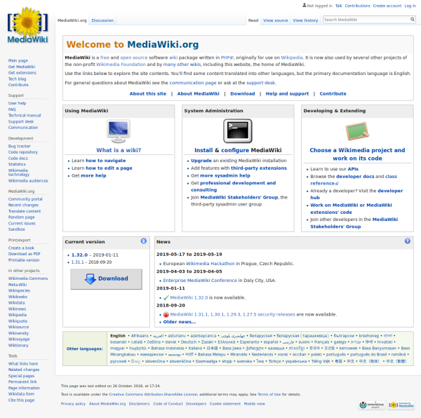

# Mediawiki

MediaWiki est un ensemble wiki à base de logiciels libres Open source, développé à l’origine pour Wikipédia.

## Aperçu

## Liens

Mediawiki : https://www.mediawiki.org/  
FAQ : https://www.mediawiki.org/wiki/Special:MyLanguage/Manual:FAQ  
Support Desk : https://www.mediawiki.org/wiki/Project:Support_desk