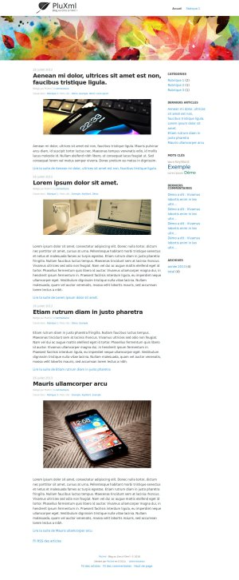

# PluXml

PluXml est un moteur de blog/CMS stockant ces données en XML et ne nécessitant pas de base de données SQL.

## Aperçu

## Plugins et thèmes

Les plugins et thèmes doivent être installés manuellement respectivement dans les dossiers `/var/www/pluxml/plugins` et `/var/www/pluxml/themes`.

## Sauvegarde

Pour sauvegarder votre blog, il est nécessaire de réaliser une copie du dossier `/var/www/pluxml/data`. Cette procédure de sauvegarde est également recommandée avant toute mise à jour de l'application.

## Liens

PluXml : https://www.pluxml.org/  
Documentation : https://wiki.pluxml.org/  
Forum : https://forum.pluxml.org/