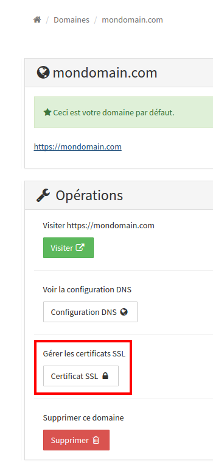
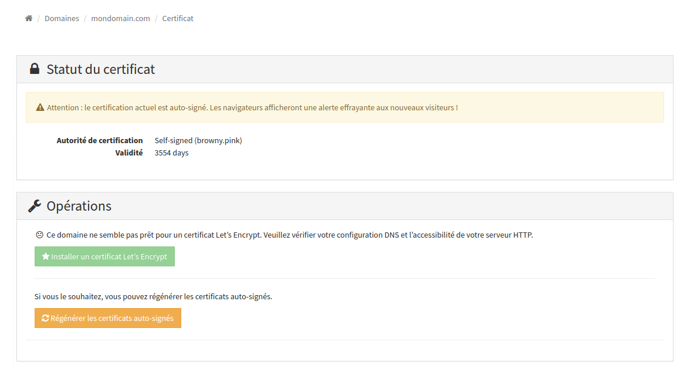
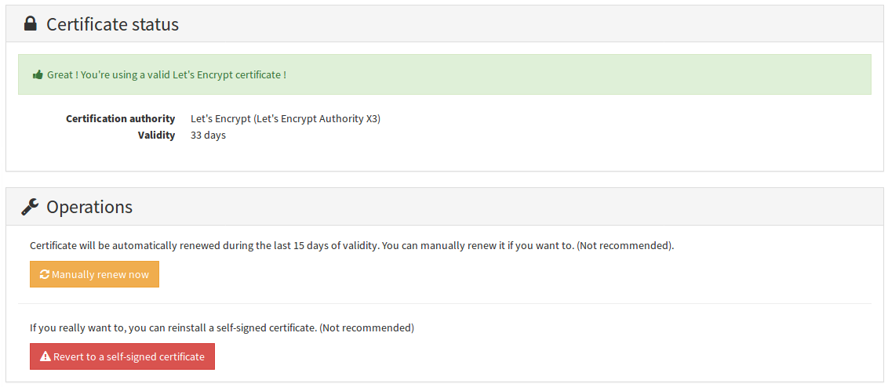

#Certificate

Certificates are used to certify that your server is the genuine one and not a falsified one.

YunoHost provides a **self-signed** certificate, it means that your server guaranty the certificate validity. It's enough **for personal usage**, because you trust your own server. But this could be a problem if you want to open access to anonymous like web user for a website.
Concretely users will go throw a screen like this:


This screen ask to the user : **"Do you trust this server that host this website?"**
It could afraid a lot of users (rightly).

To avoid this confusion, it's possible to get a signed certificate  by a "known" authority : **Gandi**, **RapidSSL**, **StartSSL**, **CaCert**.
In these cases, the point is to replace the self-signed certificate with the one that has been certified by a certificate authority, and the users won't have this warning screen anymore.

To avoid this confusion, it's possible to get a certificate signed a known
authority named **Let's Encrypt** which provide free certificates directly
recognized by browsers. YunoHost allows to directly install this certificate
from the web administration interface or from the command line.

### Install a Let's Encrypt certificate

Before attempting to install a Let's Encrypt certificate, you should make sure
that your DNS is correctly configured (votre.domaine.tld should point to
your server's IP) and that your domain is accessible though HTTP from outside
your local network (i.e. at least port 80 should be forwarded to your server).

#### From the web administration interface

Go to the 'Domain' part of the admin interface, then in the section dedicated to
your.domain.tld. You should find a 'SSL certificate' button :



In the 'SSL certificate' section, you can see the status of the current
certificate. If you just added the domain, it should be a self-signed
certificate.



If your domain is correctly configured, it is then possible to install the
Let's Encrypt certificate via the green button.



Once the install is made, you can check that the certificate is live via your
browser by going to your domain in HTTPS. The certificate will automatically
be renewed every three months.


#### From the command line interface 

Connect to your server through SSH.

You can check the status of your current certificate with :

```
yunohost domain cert-status your.domain.tld
```

Install a Let's Encrypt certificate with

```
yunohost domain cert-install your.domain.tld
```

This should return :

```
Success! The SSOwat configuration has been generated
Success! Successfully installed Let's Encrypt certificate for domain DOMAIN.TLD!
```

Once this is done, you can check that the certificate is live via your
browser by going to your domain in HTTPS. The certificate will automatically
be renewed every three months.

##### Troubleshooting

If due to some bad tweaking, your certificate ends up in a bad state (e.g.
lost the certificate or unable to read the files), you should be able to clean
the situation by regenerating a self-signed certificate :

```
yunohost domain cert-install your.domain.tld --self-signed --force
```

If YunoHost thinks that your domain is badly configured despite the fact that
you checked the DNS configuration and you have access in HTTP to your server
from outside your local network, then you can :

- add a line `127.0.0.1 your.domain.tld` to the file `/etc/hosts` on your server ;
- if the certificate installation still doesn't work, you can disable the checks with `--no-checks` after the `cert-install` command.

