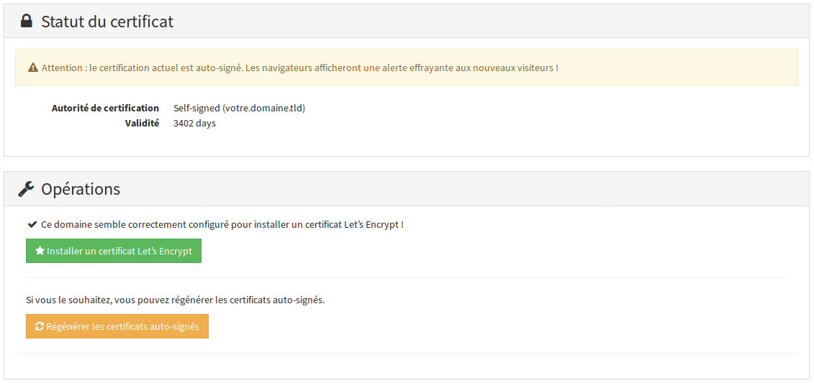
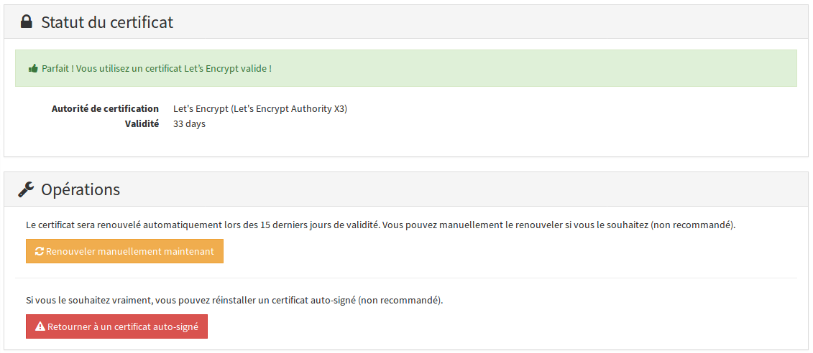
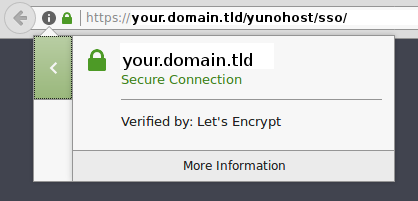

# Certificado

Los certificados sirven para garantizar la confidencialidad y la autenticidad de las comunicaciones entre un navegador web y tu servidor. En particular, permite proteger los visitantes contra atacantes que podrían intentar de robar la identidad del servidor.

Por defecto, Yunohost provee un certificado **auto-firmado**, lo que significa que es tu servidor el que garantiza la validez del certificado. Es suficiente **en el caso de un uso personal**, porque puedes confiar en tu propio servidor, pero esto planteará problemas si piensas en abrir el acceso a tu servidor a personas anónimas, por ejemplo si quieres alojar un sitio web.
En efecto, los usuarios deberán pasar por una pantalla de este tipo :


Esta pantalla equivale a que te pidan ** ¿ Confías en el servidor que aloja este sitio ? ***. Esto puede asustar tu usuarios (con toda la razón).

Para evitar esta confusión, es posible obtener un certificado, reconocido directamente por los navegadores, firmado por una autoridad « conocida » : **Let's Encrypt**, **Gandi**, **RapidSSL**, **StartSSL**, **Cacert**.

**Let's Encrypt** propone certificados gratuitos. Desde la versión 2.5, Yunohost permite instalar directamente tales certificados desde la interfaz de administración o la línea de comandos. El resto del documento detalla la instalación y la firma de este tipo de certificado. También puedes [instalar un certificado de otra autoridad que Let's Encrypt](/certificate_custom_es).

### Instalar un certificado Let's Encrypt

Antes de intentar la instalación de un certificado Let's Encrypt, primero debes asegurarte de que el DNS está configurado correctamente (tu.dominio.tld debe apuntar hacia la IP de tu servidor) y que el sitio está accesible en HTTP desde afuera (i.e. por lo menos que el puerto 80 está correctamente redirigido hacia tu servidor).

#### Vía la interfaz de administración web

En la categoría 'Dominio' de la interfaz de administración, y luego en la sección dedicada a tu dominio, encontrarás un botón 'Certificado SSL'.


En la sección 'Certificado SSL', puedes ver el estado corriente del certificado.
Si acabas de añadir el dominio, ya dispone de un certificado auto-firmado.



Si tu dominio está configurado correctamente, es posible instalar un certificado Let's Encrypt vía el botón verde.



Una vez la instalación terminada, puedes ir a tu dominio vía tu navegador, en HTTPS, para comprobar que tu certificado está bien firmado por Let's Encrypt. El certificado se renovará automáticamente al cabo de cada periodo de tres meses.



#### Vía línea de comandos

Conectate en tu servidor en SSH.

Puedes comprobar el estatus corriente de tu certificado vía 

```bash
yunohost domain cert-status tu.dominio.tld
```

Instala el certificado Let's Encrypt vía

```bash
yunohost domain cert-install tu.dominio.tld
```

Este comando debe devolverte :

```bash
Success! The SSOwat configuration has been generated
Success! Successfully installed Let's Encrypt certificate for domain DOMAIN.TLD!
```

Una vez que la instalación está terminada, puedes dirigirte a tu dominio vía tu navegador, en HTTPS, para comprobar que el certificado está bien firmado por Let's Encrypt. El certificado se renovará automáticamente al cabo de cada periodo de tres meses.

##### Si hay un problema

Si, después de una manipulación incorrecta, un certificado se encuentra en una mala situación (e.g. pérdida del certificado o imposibilidad de leerlo), es posible regenerar un certificado autofirmado :

```bash
yunohost domain cert-install tu.dominio.tld --self-signed --force
```

Si Yunohost te dice que tu dominio está mal configurado mientras que has verificado tu configuración DNS y que tienes acceso a tu servidor en HTTP desde afuera, puedes intentar :

- de añadir una línea `127.0.0.1 tu.dominio.tld` al archivo `/etc/hosts` en tu servidor ;
- si la instalación todavía no funciona, desactiva las verificaciones añadiendo `--no-checks` al comando `cert-install`.


