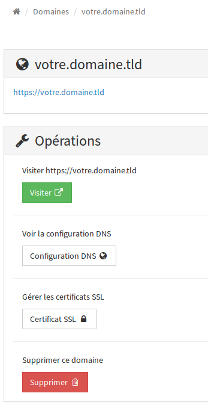
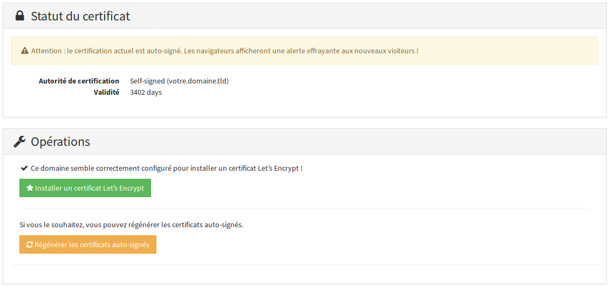
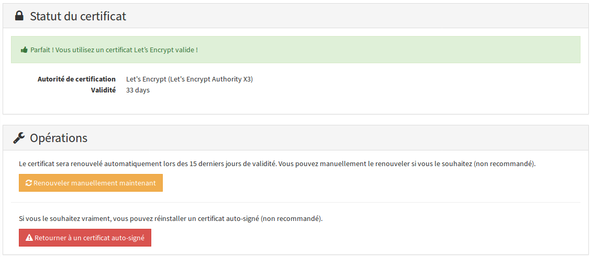
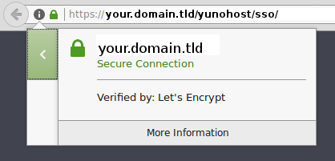

# Certificat

Les certificats sont utilisés pour garantir la confidentialité et l'authenticité des communications entre un navigateur web et votre serveur. En particulier, il permet de protéger les visiteurs contre des attaquants qui chercheraient à usurper l'identité du serveur.

YunoHost fournit par défaut un certificat **auto-signé**, ce qui veut dire que c’est votre serveur qui garantit la validité du certificat. C’est suffisant **pour un usage personnel**, car vous pouvez avoir confiance en votre serveur, en revanche cela posera problème si vous comptez ouvrir l’accès à votre serveur à des anonymes, par exemple pour héberger un site web.
En effet, les utilisateurs devront passer par un écran de ce type :


Cet écran revient à demander **« Avez-vous confiance au serveur qui héberge ce site ? »**.
Cela peut effrayer vos utilisateurs (à juste titre).

Pour éviter cette confusion, il est possible d’obtenir un certificat, reconnu directement par les navigateurs, signé par une autorité « connue » : **Let's Encrypt**, **Gandi**, **RapidSSL**, **StartSSL**, **Cacert**.

**Let's Encrypt** propose des certificats gratuits. Depuis la version 2.5, YunoHost permet d'installer directement un tel certificat depuis l'interface d'administration ou la ligne de commande. La suite du document détaille l'installation et la gestion d'un tel certificat. Vous pouvez également [installer un certificat d'une autre autorité que Let's Encrypt](/certificate_custom_fr).

### Installer un certificat Let's Encrypt

Avant de chercher à installer un certificat Let's Encrypt, assurez vous que
votre DNS est correctement configuré (votre.domaine.tld doit pointer sur l'IP
de votre serveur) et que votre site est accessible en HTTP depuis l'extérieur
(c.-à-d. qu'au moins le port 80 est correctement redirigé vers votre serveur).

#### Via l'interface d'administration web

Rendez-vous dans la partie 'Domaine' de l'interface d'administration, puis dans
la section dédiée à votre domaine. Vous trouverez un bouton 'Certificat SSL'.



Dans la section 'Certificat SSL', vous pourrez voir l'état actuel du certificat.
Si vous venez d'ajouter le domaine, il dispose d'un certificat auto-signé.



Si votre domaine est correctement configuré, il vous est alors possible de
passer à un certificat Let's Encrypt via le bouton vert.



Une fois l'installation effectuée, vous pouvez vous rendre sur votre domaine
via votre navigateur, en HTTPS, pour vérifier que votre certificat est bien
signé par Let's Encrypt. Le certificat sera renouvelé automatiquement tous les
trois mois environ.



#### Via la ligne de commande

Connectez-vous sur votre serveur en SSH.

Vous pouvez vérifier le statut actuel de votre certificat via

```bash
yunohost domain cert-status votre.domaine.tld
```

Installez le certificat Let's Encrypt via

```bash
yunohost domain cert-install votre.domaine.tld
```

Cette commande doit retourner :

```bash
Success! The SSOwat configuration has been generated
Success! Successfully installed Let's Encrypt certificate for domain DOMAIN.TLD!
```

Une fois l'installation effectuée, vous pouvez vous rendre sur votre domaine
via votre navigateur, en HTTPS, pour vérifier que votre certificat est bien
signé par Let's Encrypt. Le certificat sera renouvelé automatiquement tous les
trois mois environ.

##### En cas de problème

Si suite à une mauvaise manipulation, un certificat se retrouve dans une
situation fâcheuse (e.g. perte du certificat ou impossible de lire le
certificat), il est possible de repartir sur des bases propres en regénérant un
certificat auto-signé :

```bash
yunohost domain cert-install votre.domaine.tld --self-signed --force
```

Si YunoHost trouve que votre domaine est mal configuré quand bien même vous
avez bien vérifié votre configuration DNS et avez bien accès à votre serveur en
HTTP depuis l'extérieur, vous pouvez tenter :

- d'ajouter une ligne `127.0.0.1 votre.domaine.tld` au fichier `/etc/hosts` sur votre serveur ;
- si l'installation ne fonctionne toujours pas, désactiver les vérifications en ajoutant `--no-checks` à la commande `cert-install`.


