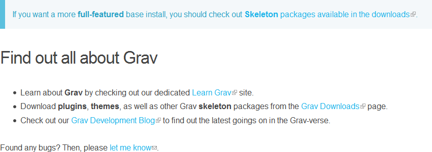

# [][project]

[][project] [][issues] [](LICENSE "License")

> This plugin adds small icons to external and mailto links, informing users the link will take them to a new site or open their email client.

**Note:** [hibbitts-design/grav-plugin-external-links](https://github.com/hibbitts-design/grav-plugin-external-links) is the new master repository for this plugin (see [getgrav/grav#2711](https://github.com/getgrav/grav/issues/2711)). Thanks to [@Sommerregen](https://github.com/Sommerregen) for originally developing this Plugin!

##### Table of Contents:

* [About](#about)
* [Installation and Updates](#installation-and-updates)
* [Usage](#usage)
    * [Example](#example)
    * [CSS Stylesheet Override](#css-stylesheet-override)
    * [Twig Filter](#twig-filter)
* [Contributing](#contributing)
* [License](#license)

## About

`External Links` is a high-quality plugin for [GetGrav.org](http://getgrav.org) used to differentiate between internal and external links. It also includes the ability of adding `rel="nofollow"` to links and determines how external links shall be opened via the `target` attribute. [Wikipedia](https://www.wikipedia.org/) is a well-known example.

Furthermore it enables you to specify multiple domains, each of them on a new line to prevent them from being seen as external sites.

If you are interested in seeing this plugin in action, here is a screenshot:



## Installation and Updates

Installing or updating the `External Links` plugin can be done in one of two ways. Using the GPM (Grav Package Manager) installation update method (i.e. `bin/gpm install external_links`) or manual install by downloading [this plugin](https://github.com/sommerregen/grav-plugin-external-links) and extracting all plugin files to

    /your/site/grav/user/plugins/external_links

For more informations, please check the [Installation and update guide](docs/INSTALL.md).

## Usage

The `External Links` plugin comes with some sensible default configuration, that are pretty self explanatory:

### Config Defaults

```yaml
# Global plugin configurations

enabled: true                 # Set to false to disable this plugin completely
built_in_css: true            # Use built-in CSS of the plugin
weight: 0                     # Set the weight (order of execution)

# Default options for External Links configuration

exclude:
  classes: [exclude]          # Exclude all links with this class
  domains:                    # A list of domains to be excluded e.g
  # - localhost/*             # (any RegExp can be used)
  # - img.domain.com/*

links:
  www: false                  # Autom. link any hostname that starts with "www."
  redirects: false            # Also mark links as external, that link to pages that redirect to an external URL

  schemes:                    # Allowed schemes
    - 'http'
    - 'https'
    - 'ftp'
    - 'irc'
    - 'mailto'
    - 'news'
    - 'nntp'
    - 'rtsp'
    - 'sftp'
    - 'ssh'
    - 'tel'
    - 'telnet'
    - 'webcal'

# Global and page specific configurations

process: true                 # Filter external links

title: false                  # Sets default title for external links
no_follow: true               # Add rel="nofollow" to all external links
target: "_blank"              # Set target attribute of link

mode: "active"                # active = process and parse all links;
                              # passive = parse links, but don't set CSS classes
```

If you need to change any value, then the best process is to copy the [external_links.yaml](external_links.yaml) file into your `users/config/plugins/` folder (create it if it doesn't exist), and then modify there. This will override the default settings.

If you want to alter the settings for one or a few pages only, you can do so by adding page specific configurations into your page headers, e.g.

```yaml
external_links: false
```

to switch off `External Links` plugin just for this page.

### Example

By default `External Links` adds a small icon to external or mailto links and opens by default links in a new tab. Any links in your Markdown file i.e. of the form

```markdown
[External Link text](http://domain.com)

or

[External Link text](https://domain.com)
```

will then be recognized as an external link (an icon on the right is showing up), whereas

```markdown
[My arcticle](my-article)
```

will not. You can exclude specific domains not to be seen as external either by adding them to the `exlcude.domains` option or by adding a class (default: `exclude`) to the desired links as in the following:

```markdown
[Domain without external link icon](http://my-specific-domain.com) {.exclude}
```

> Please note that **Markdown Extra** should be enabled in your `user/config/systems.yaml` via `pages.markdown.extra: true` in order to add classes to these links.

Sometimes you maybe wish to explicitly set a link to be "external". Although this should happen in really rare cases, since `External links` plugin will automatically detect external links, it is possible. Provided that **Markdown Extra** is enabled, adding the class `external` to the link will do the trick:

```markdown
[Always show external link icon](my-external-article) {.external}
```

### CSS Stylesheet Override

Something you might want to do is to override the look and feel of the external links, and with Grav it is super easy.

Copy the stylesheet [assets/css/external_links.css](assets/css/external_links.css) into the `css` folder of your custom theme, and add it to the list of CSS files.

    user/themes/custom-theme/css/external_links.css

After that set the `built_in_css` option of the `External Links` plugin to `false`. That's it.

You can now edit, override and tweak it however you prefer. However, this plugin adds extra classes for styling to every link, you might wanna know:

- `external`, `external-link` -- Used to identify external links.
- `mailto` -- Used to identify mailto links.
- `no-image` -- Set if a link does not contain any image tags.
- `icon`-- Set if a link contains an image (with size <= 32px).
- `image` -- Set if a link contains an image (with size > 32px).
- `images` -- Set if a link contains more than one image.

### Twig Filter

`External Links` provides a Twig filter to process external links inside contents. To do that, place the following line of code in the theme file you wish to add the `External Links` plugin for:

```
{{ page.content|external_links }}
```

You can pass arguments to the plugin filter, namely the same arguments as available in the [external_links.yaml](external_links.yaml) file. For example

```
{{ page.content|external_links({'mode': 'passive'}) }}
```

will change the mode of the `External Links` filter to parse links, but don't set CSS classes.

## Contributing

You can contribute at any time! Before opening any issue, please search for existing issues and review the [guidelines for contributing](docs/CONTRIBUTING.md).

After that please note:

* If you find a bug, would like to make a feature request or suggest an improvement, [please open a new issue][issues]. If you have any interesting ideas for additions to the syntax please do suggest them as well!
* Feature requests are more likely to get attention if you include a clearly described use case.
* If you wish to submit a pull request, please make again sure that your request match the [guidelines for contributing](docs/CONTRIBUTING.md) and that you keep track of adding unit tests for any new or changed functionality.

## License

Copyright (c) 2017+ [Benjamin Regler][github]. See also the list of [contributors] who participated in this project.

[Dual-licensed](LICENSE) for use under the terms of the [MIT][mit-license] or [GPLv3][gpl-license] licenses.

![GNU license - Some rights reserved][gnu]

[github]: https://github.com/sommerregen/ "GitHub account from Benjamin Regler"
[gpl-license]: http://opensource.org/licenses/GPL-3.0 "GPLv3 license"
[mit-license]: http://www.opensource.org/licenses/mit-license.php "MIT license"
[gnu]: https://upload.wikimedia.org/wikipedia/commons/thumb/3/33/License_icon-gpl-88x31.svg/88px-License_icon-gpl-88x31.svg.png "GNU license - Some rights reserved"

[project]: https://github.com/sommerregen/grav-plugin-external-links
[issues]: https://github.com/sommerregen/grav-plugin-external-links/issues "GitHub Issues for Grav External Links Plugin"
[contributors]: https://github.com/sommerregen/grav-plugin-external-links/graphs/contributors "List of contributors of the project"
