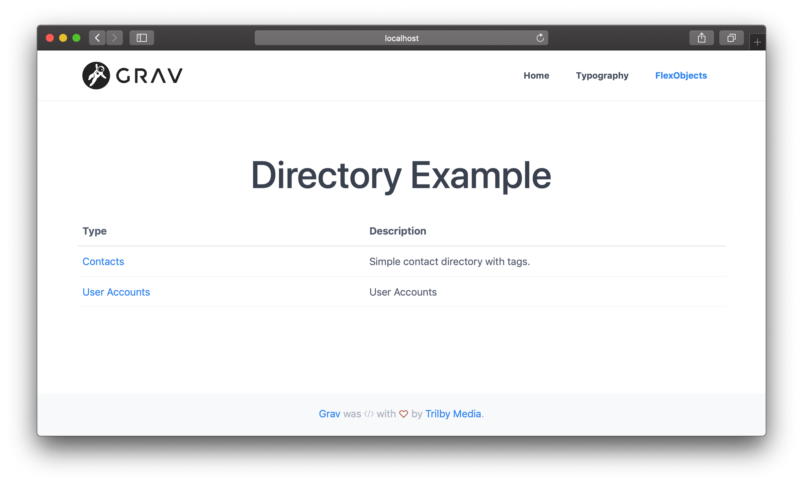

# Flex Objects Plugin

## About

The **Flex Objects** Plugin is for [Grav CMS](https://github.com/getgrav/grav).  Flex objects is a powerful new plugin that allows you to build custom collections of objects, which can modified by CRUD operations via the admin plugin to easily manage large sets of data that don't make sense as simple YAML configuration files, or Grav pages. These objects are defined by blueprints written in YAML and they are rendered by a set of twig files. Additionally both objects and collections can be customized by PHP classes, which allows you to define complex behaviors and relationships between the objects.


## System Requirements

Plugin requires **Grav** v1.7.25 or later version in order to run. Additionally you need **Form Plugin** v5.1.0 and optionally **Admin Plugin** v1.10.25 or later version.

## Installation

Typically a plugin should be installed via [GPM](http://learn.getgrav.org/advanced/grav-gpm) (Grav Package Manager):

```
$ bin/gpm install flex-objects
```

Alternatively it can be installed via the [Admin Plugin](http://learn.getgrav.org/admin-panel/plugins)

## Sample Data

Once installed you can either create entries manually, or you can copy the sample data set:

```shell
$ mkdir -p user/data/flex-objects
$ cp user/plugins/flex-objects/data/flex-objects/contacts.json user/data/flex-objects/contacts.json
```

## Configuration

This plugin works out of the box, but provides several fields that make modifying and extending this plugin easier:

```yaml
enabled: true

built_in_css: true
extra_admin_twig_path: 'theme://admin/templates'
admin_list:
  per_page: 15
  order:
    by: updated_timestamp
    dir: desc

directories:
  - 'blueprints://flex-objects/contacts.yaml'
  - 'blueprints://flex-objects/pages.yaml'
  - 'blueprints://flex-objects/user-accounts.yaml'
  - 'blueprints://flex-objects/user-groups.yaml'
```

Simply edit the **Flex Objects** plugin options in the Admin plugin, or copy the `flex-objects.yaml` default file to your `user/config/plugins/` folder and edit the values there.   Read below for more help on what these fields do and how they can help you modify the plugin.

Most interesting configuration option is `directories`, which contains list or blueprint files which will define the flex types.

## Displaying


just create a page called `flex-objects.md` or set the template of your existing page to `template: flex-objects`.  This will use the `flex-objects.html.twig` file provided by the plugin.


```twig
---
title: Directory
flex:
  directory: contacts
---

# Directory Example
```

If you do not specify `flex.directory` name in the page header, the page will list all directories instead of displaying entries from a single directory.



# Modifications

This plugin is configured with a sample contacts directory with a few sample fields:

* published
* first_name
* last_name
* email
* website
* tags

These are probably not the exact fields you might want, so you will probably want to change them. This is pretty simple to do with Flex Objects, you just need to change the **Blueprints** and the **Twig Templates**.  This can be achieved simply enough by copying some current files and modifying them.

Let's assume you simply want to add a new "Phone Number" field to the existing Data and remove the "Tags".  These are the steps you would need to perform:

1. Copy the `blueprints/flex-objects/contacts.yaml` Blueprint file to another location, let's say `user/blueprints/flex-objects/`. The file can really be stored anywhere, but if you are using admin, it is best to keep the blueprint file where admin can automatically find it.

!!! **NOTE:** If you want to put the blueprints to `user/themes/yourtheme/blueprints`, you need to use the new blueprint folder structure from Grav 1.7. See [Plugin/Theme Blueprints](https://learn.getgrav.org/17/advanced/grav-development/grav-17-upgrade-guide#plugin-theme-blueprints-blueprints-yaml).

2. Edit the `user/blueprints/flex-objects/contacts.yaml` like so:

    ```yaml
    title: Contacts
    description: Simple contact directory with tags.
    type: flex-objects
    
    config:
      admin:
        list:
          title: name
          fields:
            published:
              field:
                type: toggle
                label: Publ
              width: 8
            last_name:
              link: edit
            first_name:
              link: edit
            email:
            phone:
      data:
        storage:
            class: 'Grav\Framework\Flex\Storage\SimpleStorage'
            options:
              formatter:
                class: 'Grav\Framework\File\Formatter\JsonFormatter'
              folder: user-data://flex-objects/contacts.json
    
    form:
      validation: loose
    
      fields:
        published:
          type: toggle
          label: Published
          highlight: 1
          default: 1
          options:
            1: PLUGIN_ADMIN.YES
            0: PLUGIN_ADMIN.NO
          validate:
            type: bool
            required: true
    
        last_name:
          type: text
          label: Last Name
          validate:
            required: true
    
        first_name:
          type: text
          label: First Name
    
        email:
          type: email
          label: Email Address
          validate:
            required: true
    
        website:
          type: url
          label: Website URL
          
        phone:
          type: text
          label: Phone Number  
    ```

   See how we replaced `tags:` with `phone:` in the `config.admin.list.fields` section at the top.  Also, notice how we removed the `tags:` Blueprint field definition, and added a simple text field for `phone:`.  If you have questions about available form fields, [check out the extensive documentation](https://learn.getgrav.org/forms/blueprints/fields-available) on the subject. 

3. We need to copy the frontend Twig file and modify it to add the new "Phone" field.  By default your theme already has its `templates`, so we can take advantage of it <sup>2</sup>. We'll simply copy the `user/plugins/flex-objects/templates/flex/contacts/object/default.html.twig` file to `user/themes/quark/templates/flex/contacts/object/default.html.twig`. Notice, there is no reference to `admin/` here, this is site template, not an admin one. We are also assuming you are using `Quark` theme, so you may have to change this to reference the theme you are using.

4. Edit the `default.html.twig` file you just copied so it has these modifications:

    ```twig
    <div class="entry-details">
        
            <a href="{{ object.website }}"><span class="name">{{ object.last_name }}, {{ object.first_name }}</span></a>
        
            <span class="name">{{ object.last_name }}, {{ object.first_name }}</span>
        
        
            <p><a href="mailto:{{ object.email }}" class="email">{{ object.email }}</a></p>
        
        
            <p class="phone">{{ object.phone }}</p>
        
    </div>
    ```
    
    Notice, we removed the `entry-extra` DIV, and added a new `if` block with the Twig code to display the phone number if set.
    
5. We also need to tweak the JavaScript initialization which provides which hooks up certain classes to the search.  To do this we need to copy the `user/plugins/flex-objects/templates/flex/contacts/collection/default.html.twig` file to `user/themes/quark/templates/flex/contacts/collection/default.html.twig`. Notice this is the `collection` template this time, not the `object` template as we copied before.

    Edit this file and replace the `<script></script>` tag at the bottom with this code:
    
    ```html
    <script>
        var options = {
            valueNames: [ 'name', 'email', 'website', 'phone' ]
        };    
        var userList = new List('flex-objects', options);
    </script>
    ```

# File Upload

To upload files you can use the `file` form field.  [The standard features apply](https://learn.getgrav.org/forms/blueprints/how-to-add-file-upload), and you can simply edit your custom blueprint with a field definition similar to:

```
    item_image:
      type: file
      label: Item Image
      random_name: true
      destination: 'user/data/flex-objects/files'
      multiple: true
```

> In order to fully take advantage of image uploads, you should always be using `FolderStorage`, meaning that the objects get saved to individual folders together with the images. Other storage layers may or may not support media.

# Advanced

You can radically alter the structure of the `contacts.json` data file by making major edits to the `contacts.yaml` blueprint file.  However, it's best to start with an empty `contacts.json` if you are making wholesale changes or you will have data conflicts.  Best to create your blueprint first.  Reloading a **New Entry** until the form looks correct, then try saving, and check to make sure the stored `user/data/flex-objects/contacts.json` file looks correct.

Then you will need to make more widespread changes to the site Twig templates.  You might need to adjust the number of columns and the field names.  You will also need to pay attention to the JavaScript initialization in each template.

# Features

Here are the main benefits of using Flex objects:

* CRUD is automatically handled for you by Flex Objects plugin
* Objects can be stored using many different strategies, including single file, file per object or folder per object; using yaml, json etc.
* Flex types can be easily extended by custom PHP collection and object classes
* Both Flex objects and collections know how to render themselves: `echo $object->render($layout, $context)` or ``
* You can easily create custom layouts for your objects and collections to be used in different pages
* Both Flex objects and collections support serialization and `json_encode()`
* Flex objects support Grav `Medium` objects with few lines of code
* Flex objects can have relations to other Flex objects with few lines of code defining the relation
* Flex directories support indexes which allow searching objects without loading all of them
* Efficient caching for indexes, searches, objects and rendered output

# Limitations and future improvements

Right now there are a few limitations:

* Frontend only has a basic routing for the individual pages (you need to do the advanced routing manually by yourself)
* Administration needs more features like filtering, bulk updates etc
* It would be nice to have an easy way to display Flex admin in other admin plugins (it is already possible, but not easy)
* Optional database storage layer would be nice to have
* We need general collection functions to do simple filtering, like: "display all published items" without custom PHP code

### Notes:

1. You can actually use pretty much any folder under the `user/` folder of Grav. Simply edit the **Extra Admin Twig Path** option in the `flex-objects.yaml` file.  It defaults to `theme://admin/templates` which means it uses the default theme's `admin/templates/` folder if it exists.
2. You can use any path for front end Twig templates also, if you don't want to put them in your theme, you can add an entry in the **Extra Site Twig Path** option of the `flex-objects.yaml` configuration and point to another location.

# Tricks and tips

* You can enable and disable directories from **Plugins** > **Flex Objects**
  * New Flex Directories can be registered by simply creating a new blueprint file in `user/blueprints/flex-objects` folder
  * You can also add types from your plugins by hooking into `onFlexInit` event (see `AccountsServiceProvider` in Grav)
* To properly create your own custom types, you need at least the object blueprint and the template files for collections and objects
* Use `flex-objects.md` page to create entry point for your own directory
  * In page header you can use nested `flex.directory` variable to define the directory (or do it in admin) 
  * In Admin you can just select the directory under the page title


# Parameters supported by Flex page type:

```
---
title: 'Flex Directories'
flex:
    directories:
        layout: default
        list:
            - accounts
            - contacts        
---
```

`directories.layout`: uses template file `templates/flex-objects/directories/[LAYOUT].html.twig`
`directories.list`: list of flex directories displayed in this page
