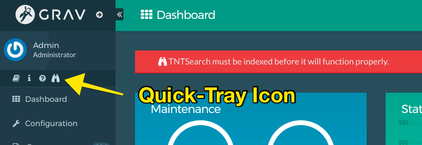
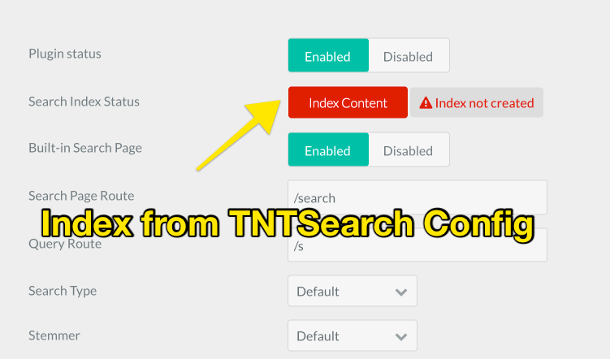

# TNTSearch Plugin

The **TNTSearch** Plugin is for [Grav CMS](http://github.com/getgrav/grav). Powerful indexed-based full text search engine powered by the [TNTSearch library](https://github.com/teamtnt/tntsearch) that provides fast Ajax-based Grav content searches.  This plugin is highly flexible allowing indexes of arbitrary content data as well as custom Twig templates to provide the opportunity to index modular and other dynamic page types. TNTSearch provides CLI as well as Admin based administration and re-indexing, as well as a built-in Ajax-powered front-end search tool.

> NOTE: TNTSearch version 3.0.0 now requires Grav 1.6.0 or newer to function as it makes use of new functionality not available in previous versions.


## Installation

Installing the Tnt Search plugin can be done in one of two ways. The GPM (Grav Package Manager) installation method enables you to quickly and easily install the plugin with a simple terminal command, while the manual method enables you to do so via a zip file.

### GPM Installation (Preferred)

The simplest way to install this plugin is via the [Grav Package Manager (GPM)](http://learn.getgrav.org/advanced/grav-gpm) through your system's terminal (also called the command line).  From the root of your Grav install type:

    bin/gpm install tntsearch

This will install the Tnt Search plugin into your `/user/plugins` directory within Grav. Its files can be found under `/your/site/grav/user/plugins/tntsearch`.

## Requirements

Other than standard Grav requirements, this plugin does have some extra requirements.  Due to the complex nature of a search engine, TNTSearch utilizes a flat-file database to store its wordlist as well as the mapping for content.  This is handled automatically by the plugin, but you do need to ensure you have the following installed on your server:

* **SQLite3** Database
* **PHP pdo** Extension
* **PHP pdo_sqlite** Driver
* **PHP pdo_mysql** Driver (only required because library references some MySQL constants, MySQL db is not used)

| PHP by default comes with **PDO** and the vast majority of linux-based systems already come with SQLite.  

### Installation of SQLite on Mac systems

SQLite actually comes pre-installed on your Mac, but you can upgrade it to the latest version with Homebrew:

Install [Homebrew](https://brew.sh/)

```shell
$ /usr/bin/ruby -e "$(curl -fsSL https://raw.githubusercontent.com/Homebrew/install/master/install)"
```

Install SQLite with Homebrew

```shell
$ brew install sqlite
```

### Installation of SQLite on Windows systems

Download the appropriate version of SQLite from the [SQLite Downloads Page](https://www.sqlite.org/download.html).  

Extract the downloaded ZIP file and run the `sqlite3.exe` executable.


## Configuration

Before configuring this plugin, you should copy the `user/plugins/tntsearch/tntsearch.yaml` to `user/config/plugins/tntsearch.yaml` and only edit that copy.

Here is the default configuration and an explanation of available options:

```yaml
enabled: true
search_route: '/search'
query_route: '/s'
built_in_css: true
built_in_js: true
built_in_search_page: true
enable_admin_page_events: true
search_type: auto
fuzzy: false
phrases: true
stemmer: default
display_route: true
display_hits: true
display_time: true
live_uri_update: true
limit: 20
min: 3
snippet: 300
index_page_by_default: true
scheduled_index:
    enabled: false
    at: '0 */3 * * *'
    logs: 'logs/tntsearch-index.out'
filter:
  items:
    - root@.descendants
powered_by: true
search_object_type: Grav      
```

The configuration options are as follows:

* `enabled` - enable or disable the plugin instantly
* `search_route` - the route used for the built-in search page
* `query_route` - the route used by the search form to query the search engine
* `built_in_css` - enable or disable the built-in css styling
* `built_in_js` - enable or disable the built-in javascript
* `built_in_search_page` - enable or disable the built-in search page
* `enable_admin_page_events` - enable or disable the page events which occur `on-save` to add/update/remove page in index
* `search_type` - can be one of these types:
  * `basic` - standard string matching
  * `boolean` - supports `or` or `minus`. e.g. `foo -bar`
  * `auto` - automatically detects whether to use `basic` or `boolean`
* `fuzzy` - matches if the words are 'close' but not necessarily exact matches
* `phrases` - automatically handle phrases support
* `stemmer` - can be one of these types:
  * `default` - Porter stemmer for English language
  * `no` - no stemmer
  * `arabic` - Arabic language
  * `german` - German language
  * `italian` - Italian language
  * `porter` - Porter stemmer for English language
  * `russian` - Russian language
  * `ukrainian` - Ukrainian language
* `display_route` - display the route in the search results
* `display_hits` - display the number of hits in the search results
* `display_time` - display the execution time in the search results
* `live_uri_update` - when `built_in_js` is enabled, live updates the URI bar in the `search_route` page
* `limit` - maximum amount of results to be shown
* `min` - mininum amount of characters typed before performing search
* `snippet` - amount of characters for previewing a result item
* `index_page_by_default` - should all pages be indexed by default unless frontmatter overrides
* `scheduled_index` - New scheduled index job.  Disabled by default, when enabled defaulted to run every 3 hours, and output results to `logs/tntsearch-index.out`
* `filter` - a [Page Collections filter](https://learn.getgrav.org/content/collections#summary-of-collection-options) that lets you pick specific pages to index via a collection query
* `powered_by` - Display the **powered-by TNTSearch** text
* `search_object_type` - Allows custom classes to override the default **Grav Page** support. This allows completely custom searching capabilities for any data type.

## Usage

TNTSearch relies on your content being indexed into the SQLite index database before any search queries can be made.  This is very similar to other search engines such as ElasticSearch, Solr, Lucene, etc, but it uses a relatively simply PHP search engine library [TNTSearch library](https://github.com/teamtnt/tntsearch) to achieve this with little setup and no hassles.

### Indexing

The first step after installation of the plugin, is to index your content.  There are several ways you can accomplish this.  

#### CLI Indexing

First if you are able to access the CLI or just choose not to use the admin plugin, you can use the built-in CLI command:

```shell
$ bin/plugin tntsearch index
```

This will scan all your pages and index the content.  You should see some output like this:

```shell
Re-indexing Search

Added 1 /
Added 2 /blog/classic-modern-architecture
Added 3 /blog/daring-fireball-link
Added 4 /blog/focus-and-blur
Added 5 /blog/just-some-text-today
Added 6 /blog/london-industry
Added 7 /blog/random-thoughts
Added 8 /blog/sunshine-in-the-hills
Added 9 /blog/the-urban-jungle
Total rows 9
Done.
```

This indicates a successful indexing of your content.

#### Admin Plugin Indexing

If you are using the admin plugin you can index your content directly from the plugin.  TNTSearch adds a new **quick-tray** icon that lets you create a new index or re-index all your content quickly and conveniently with a single click.  



Alternatively you can navigate to the TNTSearch configuration section and click the `Index Content` button:



#### Skipping Indexing

> NOTE: That any page that uses a `redirect` page header attribute will be skipped during indexing.

You can explicitly skip a page that is in the index filter by adding this YAML to the page header:

```
tntsearch:
    index: false
```

#### Multi-Language Support

With the new 3.0 version of TNTSearch, support has been added for multiple languages (Grav 1.6 required).  Internally, this means that rather that store the index as `user:://data/tntsearch/grav.index`, multiple indexes are created per language configured in Grav.  For example if you have set the supported languages to `['en', 'fr', 'de']`, then when you perform an index,  you will get three files: `en.index`, `fr.index`, and `de.index`.  When querying the appropriate **active language** determines which index is queried.  For example, performing the search on a page called `/fr/search` will result in the `fr.index` database to be used, and French results to be returned.  

Note Indexing will take longer depending on the number of languages you support as TNTSearch has to index each page in each language.

> NOTE: While accented characters is supported in this release, there is currently no support in the underlying TNTSearch library to match non-accented characters to accented ones, so exact matches are required.

#### Scheduler Support

One of the great new features of Grav 1.6 is the built in **Scheduler** that allows plugin-provided functionality to be run periodically.  TNTSearch is a great use-case for this capability as it allows an indexing job to be scheduled to be run every few hours without the need to manually keep things in sync. There are a few options that allow you to configure this capability.

First note, that this scheduler functionality is disable by default, so you first have to enable the scheduler functionality in the TNTSearch plugin settings.  After that you can configure how often the indexing job should run.  The default is every 3 hours. Lastly, you can configure where any indexing output is logged to.

#### Admin Page CrUD Events

Once you have an index, TNTSearch makes use of admin events to **C**reate, **U**pdate, and **D**elete index entries when you edit pages.  If your index ever looks like it's out of sync, you can simply reindex your whole site.

#### Customizing the Search Index

##### Adding Custom Fields

By default the TNTSearch plugin will index the `title` and `content` of your page.  This usually suffices for most cases, but there are situations where you might want to index more fields.  The plugin provides an example of this by listening to the `onTNTSearchIndex` event:

```php
public static function getSubscribedEvents()
{
    return [
        'onTNTSearchIndex' => ['onTNTSearchIndex', 0]
    ];
}

public function onTNTSearchIndex(Event $e)
{
    $fields = $e['fields'];
    $page = $e['page'];

    if (isset($page->header()->author)) {
        $fields->author = $page->header()->author;
    }
}
```

This allows you to add an author to the indexed fields if it is set in the page frontmatter.  You can add your own custom fields with a very simple plugin that listens to this event.

##### Providing Custom Render Templates

The TNTSearch plugin generally uses the rendered content to index with.  However, there are situations where your page is actually a modular page, or built from other pages where there is no actual content on the page, or the content is not representative of the page as a whole.  To combat this situation you can provide custom templates in your theme that TNTSearch can use to render the content before indexing.

For example, say we have a homepage that is built from a few modular sub-pages with a little content below it, it's called `home.md`, so uses a `home.html.twig` file in your theme's `templates/` folder.  You can create a simplified version of this template and save it as `templates/tntsearch/home.html.twig`. For this example this template looks like this:

```twig

<p>
    {{ module.content|raw }}
</p>


{{ page.content|raw }}
``` 

As you can see this simply ensures the module pages as defined in the page's collection are displayed, then the actual page content is displayed.  

To instruct TNTSearch to index with this template rather than just using the Page content by itself, you just need to add an entry in the `home.md` frontmatter:

```yaml
tntsearch:
    template: 'tntsearch/home'
```

### Searching

TNTSearch plugin for Grav comes with a built-in query page that is accessible via the `/search` route by default. This search page is a simple input field that will perform an Ajax query **as-you-type**.  Because TNTSearch is so fast, you get a real-time search response in a similar fashion to a Google search.  Also the results are returned already highlighted for matching terms.

You can also test searching with the CLI:

```json
$ bin/plugin tntsearch query ipsum

{
    "number_of_hits": 3,
    "execution_time": "2.101 ms",
    "hits": [
        {
            "link": "\/blog\/classic-modern-architecture",
            "title": "Classic Modern Architecture",
            "content": "...sed a odio. Curabitur ut lectus tortor. Sed <em>ipsum<\/em> eros, egestas ut eleifend non, elementum vitae eros. Mauris felis diam, pellentesque vel lacinia ac, dictum a nunc.\nLorem <em>ipsum<\/em> dolor sit amet, consectetur adipiscing elit. Donec ultricies tristique nulla et mattis. Phasellus id massa eget..."
        },
        {
            "link": "\/blog\/focus-and-blur",
            "title": "Focus and Blur",
            "content": "...sed a odio. Curabitur ut lectus tortor. Sed <em>ipsum<\/em> eros, egestas ut eleifend non, elementum vitae eros. Mauris felis diam, pellentesque vel lacinia ac, dictum a nunc.\nLorem <em>ipsum<\/em> dolor sit amet, consectetur adipiscing elit. Donec ultricies tristique nulla et mattis. Phasellus id massa eget..."
        },
        {
            "link": "\/blog\/london-industry",
            "title": "London Industry at Night",
            "content": "...sed a odio. Curabitur ut lectus tortor. Sed <em>ipsum<\/em> eros, egestas ut eleifend non, elementum vitae eros. Mauris felis diam, pellentesque vel lacinia ac, dictum a nunc.\nLorem <em>ipsum<\/em> dolor sit amet, consectetur adipiscing elit. Donec ultricies tristique nulla et mattis. Phasellus id massa eget..."
        }
    ]
}
```

### Customizing the Search Page

If a physical Grav page is found for the `/search` route, TNTSearch will use that rather than the page provided by the plugin.  This allows you to easily add content to your search page as you need.
If you wish to customize the actual HTML output, simply copy the `templates/search.html.twig` from the plugin to your theme and customize it.

The actual input field can also be modified as needed by copy and editing the `templates/partials/tntsearch.html.twig` file to your theme and modify it.

### Customizing Query Data

By default the TNTSearch plugin for Grav, the response JSON is sent with the following structure:

```json
{
    "number_of_hits": 3,
    "execution_time": "1.000 ms",
    "hits": [
        {
            "link": "/page-a",
            "title": "Title A",
            "content": "highlighted-summary"
        },
        {
            "link": "/page-b",
            "title": "Title B",
            "content": "highlighted-summary"
        },
        {
            "link": "/page-c",
            "title": "Title C",
            "content": "highlighted-summary"
        }
    ]
}
```

There are instances where this output is not desirable or needs to be changed.  TNTSearch actually provides a plugin event to allow you to manipulate this format.  An example of this can be seen below:

```php
public static function getSubscribedEvents() {
    return [
        'onTNTSearchQuery' => ['onTNTSearchQuery', 1000],
    ];
}

public function onTNTSearchQuery(Event $e)
{
    $query = $this->grav['uri']->param('q');

    if ($query) {
        $page = $e['page'];
        $query = $e['query'];
        $options = $e['options'];
        $fields = $e['fields'];
        
        $fields->results[] = $page->route();
        $e->stopPropagation();
    }
}
```

The important things to note are the `1000` order-value to ensure this event runs before the default event in the `tntsearch.php` plugin file. The actual event method simply sets a result array on fields to with a route, resulting in:

```json
{
    "number_of_hits": 3,
    "execution_time": "1.000 ms",
    "results": ['/page-a', '/page-b', '/page-c']
}
```

### Dropdown Search Field

TNTSearch plugin can also be used to render the search as a drop-down rather than in a standard page.  To do this you need to `embed` the search partial and override it to fit your needs.  You could simply add this to your theme wherever you want to have an Ajax drop-down search box:

```twig

```

Here we embed the default partial, but override the `options` by passing them in the `with` statement. It is important to notice that the `dropdown: true` is required to be set in order to be interpreted as dropdown.

## Credits

This plugin would not of been possible without the amazing [TNTSearch library](https://github.com/teamtnt/tntsearch) for PHP. Make sure you **star** that project on GitHub.
