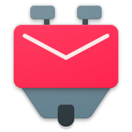

## Configuring email client

You can fetch and send emails using your YunoHost instance from desktop email clients such as Mozilla Thunderbird or on your smartphone with applications like K-9 Mail.

##### Generic settings

| Protocol | Port | Encryption | Authentication  | Username                               |
| :--:     | :-:  | :--:       | :--:            | :--:                                   | 
| IMAP     | 993  | SSL/TLS    | Normal password | `username` (without the `@domain.tld`) |
| SMTP     | 587  | STARTTLS   | Normal password | `username` (without the `@domain.tld`) |

###  Configure Mozilla Thunderbird (on a desktop computer)

The automatic detection tool of Thunderbird does not work yet with YunoHost. You will need to set it up manually. To do so, add the account information, then select port 993 with SSL/TLS for IMAP, and port 587 with STARTTLS for SMTP. Afterwards select 'Normal Password' for Authentication and click on 'Advanced Config'. You will need to accept the certificate exceptions for fetching mails and after you send your first mail. Don't forget to remove the dot before the domain name.

* [Manage alias mails](https://support.mozilla.org/en-US/kb/configuring-email-aliases)

###  Configure K-9 Mail (on Android)

Follow the following steps. (As for thunderbird, you might need to accept certificates at some points)

