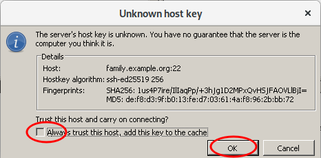
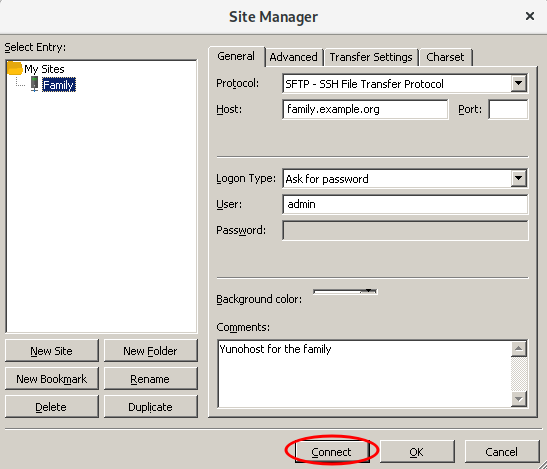
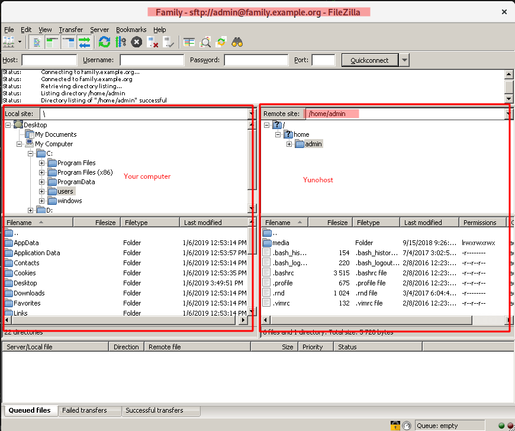
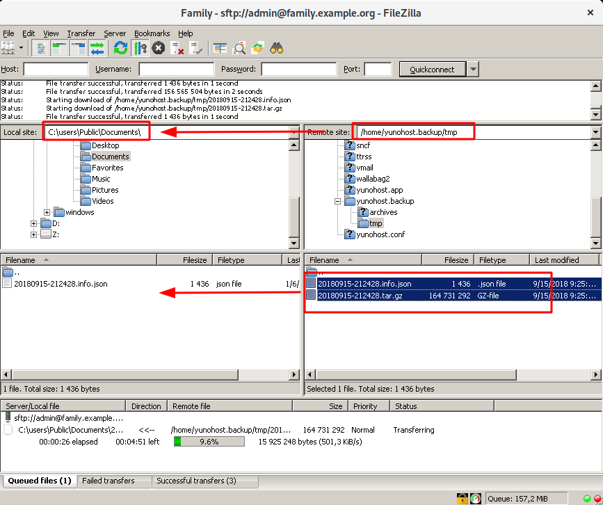

# Exchange files with your server graphically

This page will explain how to exchange files with your server graphically so you don't necessary have to use [SCP cryptic commands](/backup) or Nextcloud.

You could want to download your backups or send some music, pictures, movies, ...

[`Filezila`](https://filezilla-project.org/) will be mainly used as it is a free software and is available for Windows, Linux and macOS.

## Requirements

You will need to know the `IP` or `domain name` of your server for being able to connect to it.
See page [SSH](/ssh) if you don't know this information.

## Filezilla

### Download and install

Get the client from the [download page](https://filezilla-project.org/download.php?type=client). It should autodetect the version needed for your computer. If it fails, follow the instructions to [install the client](https://wiki.filezilla-project.org/Client_Installation)

Install the program and run `Filezila`.

### Configuration

1. Click the *Site Manager* icon in the upper left to begin setting up a connection bookmark for future use.

    

2. Click **New Site** and give a name the server you will be using : *Familly* here. Fill the settings as on the screenshot except for your server which should be yours

    Once finish, click on **Connect**

    

3. You will get a warning as you connect for the first time to the server. *You can ignore it safely the first time you get it*

    

4. Filezilla is now asking the `admin` password for connecting to your server

    

5. Once bookmarked, your server will be backup up and you will get this screen

    

   You can now use your new bookmark to connect to the server

### Usage

1. Connect to the Site created previously. *Your passwork might be asked again*

    On the left, you have your computer and on the right, the remote Yunohost server. You can navigate between folders as if you were on your computer and do drag and drops.

    

2. In the right panel, navigate to `/home/yunohost.backup/archives/` where the backups are stored.

    

#### Workaround to retrieve the backups

   Since Yunohost version 3.3 and the choice to connect as the `admin` user, there is a [limitation](https://github.com/YunoHost/issues/issues/1266) that prevents straight access to the backups folder `/home/yunohost.backup/archives/`

Until the issue is solved, you will need to follow [a workaround](/backup_workaround) to manage the backup files.

#### Back to Filezilla

You can now see backups previously copied and download them to your computer.

   Be sure to download both files

----

Sources

* [Official documentation](https://wiki.filezilla-project.org/FileZilla_Client_Tutorial_(en))
* <https://www.rc.fas.harvard.edu/resources/documentation/sftp-file-transfer/>

## Alternatives to Filezilla

### Windows

* [`WinSCP`](https://winscp.net/) is also a nice candidate for Windows

### Linux

From any recent Linux, you should be able to use the `file manager` to reach your server.

Nautilus from Gnome3 can access out of the box.

* <https://help.gnome.org/users/gnome-help/stable/nautilus-connect.html.en>
* <https://www.techrepublic.com/article/how-to-use-linux-file-manager-to-connect-to-an-sftp-server/>

### MacOS

Feel free to complete this part