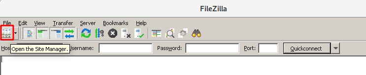
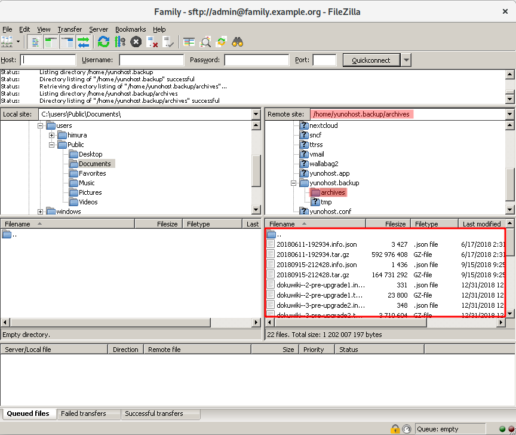

# Échanger des fichiers avec son serveur à l'aide d'une interface graphique

Cette page explique comment échanger des fichiers (sauvegardes, musiques,
photos, films, ...) avec son serveur à l'aide d'un outil graphique. C'est donc
une méthode alternative au fait d'utiliser la commande `scp` qui peut être jugée
technique et cryptique, ou de devoir installer Nextcloud.

[FileZilla](https://filezilla-project.org/) permet d'accomplir cela. Il s'agit
d'un logiciel libre disponible pour Windows, Linux et MacOS.

## Télécharger et installer FileZilla

Vous pouvez télécharger FileZilla depuis [cette page](https://filezilla-project.org/download.php?type=client).
Le site devrait détecter automatiquement la version nécessaire pour votre ordinateur.
Sinon, suivez les instructions pour [installer le client](https://wiki.filezilla-project.org/Client_Installation)

Installez le programme et lancez *Filezilla*.

## Configuration

1. Cliquez sur l'icône *Gestionnaire de Sites* en haut à gauche de sorte à crééer une configuration utilisable ultérieurement.

   

2. Cliquez sur **Nouveau site** et donnez un nom au serveur que vous allez utiliser. Par exemple "Famille". Remplissez les paramètres comme sur la capture d'écran (en remplaçant l'adresse du serveur par la votre). Une fois terminé, cliquez sur **Connexion**. (N.B. : si vous souhaitez éditer les fichiers de l'application [custom webapp](https://github.com/YunoHost-Apps/my_webapp_ynh), il vous faudra utiliser un autre utilisateur que admin. Se référer à la documentation de custom webapp.)

   

3. Vous recevrez un avertissement. *Vous pouvez l'ignorer si il s'agit de la première connexion*.

   

4. Filezilla vous demande maintenant le mot de passe `admin` pour vous connecter à votre serveur

   

5. Une fois cette configuration créée, elle sera réutilisable les fois suivanteS.

   

   Vous pouvez désormais utiliser cette configuration pour vous connecter.

## Utilisation

1. Connectez-vous au Site créé précédemment. *Il se peut que le mot de passe soit redemandé.*

   La partie gauche correspond à votre ordinateur. La partie droite correspond au serveur YunoHost distant. Vous pouvez naviguer dans les dossiers et faire des glisser-déposer entre les deux panneaux.

   

2. Dans le panneau de droite, vous pouvez aller dans `/home/yunohost.backup/archives/` pour trouver les archives de [sauvegardes](/backup_fr).

   

   Assurez-vous de télécharger à la fois le fichier `.tar.gz` et le fichier `.json`

----

Sources

* [Documentation officielle](https://wiki.filezilla-project.org/FileZilla_Client_Tutorial_(fr))
* [Tutoriel général à Filezilla](https://www.rc.fas.harvard.edu/resources/documentation/sftp-file-transfer/)

## Alternatives à Filezilla

### Sous Linux

Depuis n'importe quel Linux récent, vous devriez pouvoir utiliser le gestionnaire de fichiers pour accéder à votre serveur.

Nautilus de Gnome3 intègre de base des fonctionnalités similaires à FileZilla :

* <https://help.gnome.org/users/gnome-help/stable/nautilus-connect.html.en>
* <https://www.techrepublic.com/article/how-to-use-linux-file-manager-to-connect-to-an-sftp-server/>

### Sous Windows

* [WinSCP](https://winscp.net/) est aussi un bon candidat pour Windows

### Sous MacOS

* [Cyberduck](https://cyberduck.io/) logiciel libre pour MacOS
