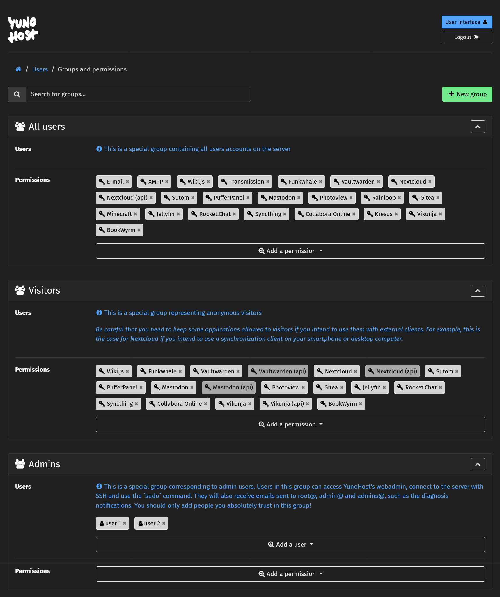
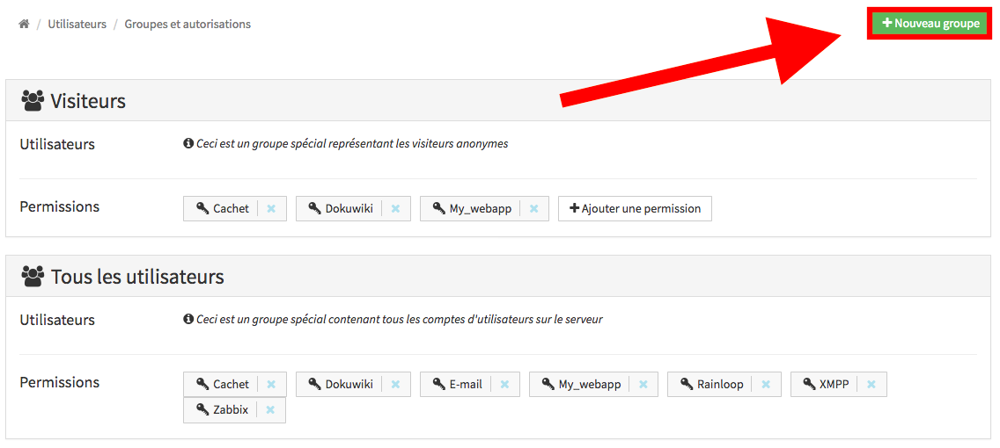
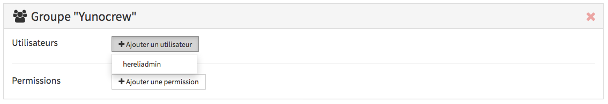
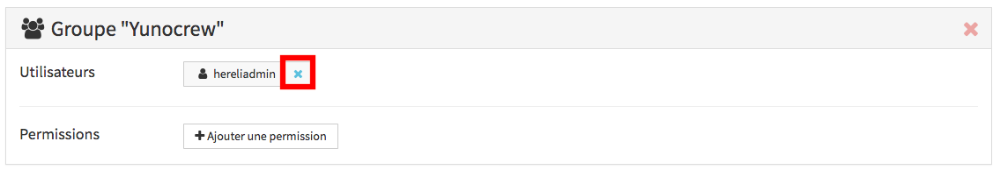
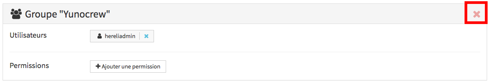
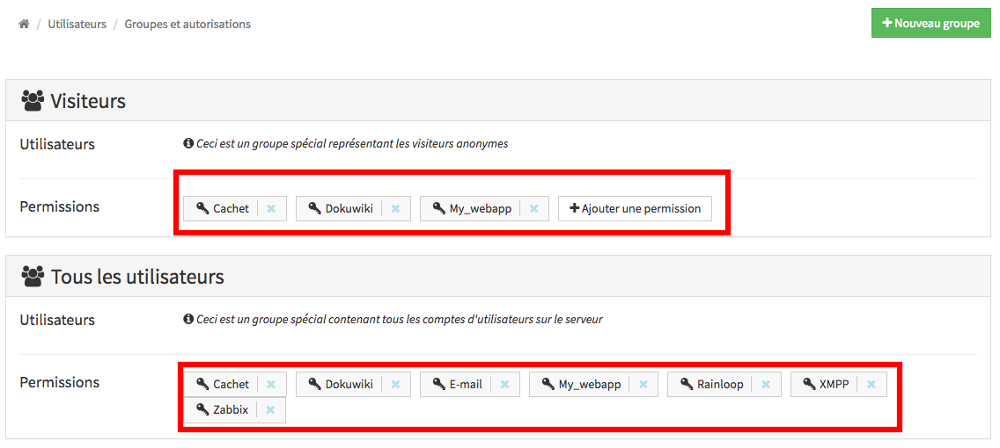
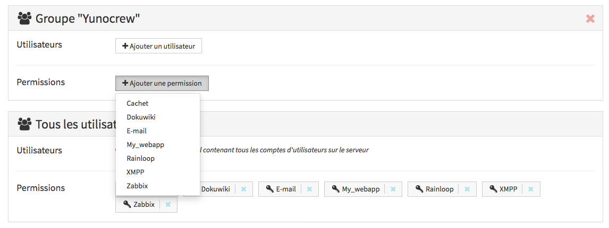
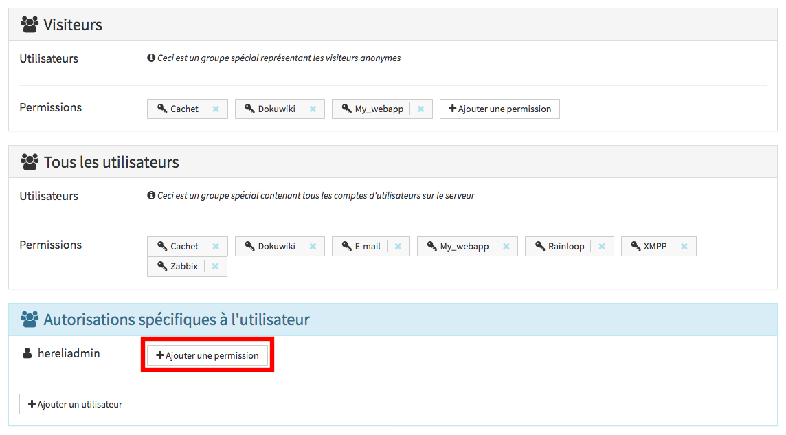

# User groups and permissions

You can access the *groups and permissions* management interface from the webadmin
by going into the 'Users' section and clicking the corresponding button:


## Managing groups

The group mechanism can be used to define groups of users which then can be used to restrict permissions for applications and other services (such as mail or XMPP). Note that it is *not* mandatory to create a group to do so: you can also restrict access to an app or service on a user-per-user basis.

Using groups is however useful for semantics, for example if you host multiple groups of friends, associations or businesses on your server, you might want to create groups like `association1` and `association2` and add members of each association to the relevant group.

### Default groups

By default, two special groups are created:
- `all_users`, that contain all users registered on YunoHost,
- `visitors`, that applies to people viewing the server while not logged in. 

The content of those groups cannot be changed, only the permissions given to them.

### List existing groups

The existing groups are listed at the top of the *groups and permissions* page.



To list the currently existing groups in CLI :

```shell
$ yunohost user group list
groups:
  all_users:
    members:
      - alice
      - bob
      - charlie
      - delphine
```


### Creating a new group

To create a new group, simply click on the "New Group" button at the top of the page. You may only choose a name formed with letters (uper- and lowercase) and spaces. The group is created empty and without any permission.



In CLI, to create a new group called `yolo_crew`

```shell
$ yunohost user group create yolo_crew
```

### Updating a group

Let's add a first to this group: in the group panel, click the button "add a user" and scroll to the desired user, then click on it.



To remove a user, click on the cross next to their username, in the group panel.



In CLI, use the following command to add `charlie` and `delphine`to the `yolo_crew` group:

```shell
$ yunohost user group update yolo_crew --add charlie delphine
```

(similarly, `--remove` can be used to remove members from a group)

Now in the group list we should see:

```shell
$ yunohost user group list
groups:
  all_users:
    members:
      - alice
      - bob
      - charlie
      - delphine
  yolo_crew:
    members:
      - charlie
      - delphine
```

### Deleting groups

To delete a group, click on the red cross on the top right of the group panel. You will be asked for confirmation.



To delete the group `yolo_crew` in CLI, you may run

```shell
$ yunohost user group delete yolo_crew
```

## Managing permissions

The permission mechanism allow to restrict access to services (for example mail, XMPP...) and apps, or even specific parts of the apps (for example the administration interface of WordPress).

### List permissions

The groups page lists the permissions given to each group, including the special groups `all_users` and `visitors`.



To list permissions and corresponding accesses in CLI:

```shell
$ yunohost user permission list
permissions:
  mail.main:
    allowed: all_users
  wordpress.admin:
    allowed:
  wordpress.main:
    allowed: all_users
  xmpp.main:
    allowed: all_users
```

Here, we find that all registered users can use email, XMPP, and access the WordPress blog. However, nobody can access the WordPress admin interface.

More details can be displayed by adding the `--full` option which will display the list of users corresponding to groups allowed, as well as urls associated to a permission (relevant for web apps).

### Add accesses to group or users

To add a permission to a group, simply click the "+" button in the group panel, scroll to the desired permission, then click on it.



To allow a group to access the WordPress admin interface in CLI:

```shell
$ yunohost user permission update wordpress.admin --add yolo_crew
```

Note that you can also allow a single user, by using the specific panel at the bottom of the page.



or in CLI:

```shell
$ yunohost user permission update wordpress.admin --add alice
```

And now we may see that both the YoloCrew and Alice have access to the WordPress admin interface:

```shell
$ yunohost user permission list
  [...]
  wordpress.admin:
    allowed:
      - yolo_crew
      - alice
  [...]
```

Note that, for example, if we want to restrict permission for email so that only Bob is allowed to email, we should also remove `all_users` from the permission, by deleting it from the `all_users` group panel, or in CLI:

```shell
$ yunohost user permission update mail --remove all_users --add bob
```

The webadmin will issue a warning if you set a permission that is superseeded by a wider permission.


## Notes for apps packagers

Installing an app creates the permission `app.main` with `all_users` allowed by default.

If you wish to make the application publicly available, instead of the old `unprotected_urls` mechanism, you should give access to the special group `visitors`:

```shell
ynh_permission_update --permission "main" --add visitors
```

If you wish to create a custom permission for your app (e.g. to restrict access to an admin interface) you may use the following helpers:

```shell
ynh_permission_create --permission "admin" --url "/admin" --allowed "$admin_user"
```

You don't need to take care of removing permissions or backing up/restoring them as it is handled by the core of YunoHost.

### Migrating away from the legacy permission management

When migrating/fixing an app still using the legacy permission system, it should be understood that the accesses are now to be managed by features from the core, outside of the application scripts!

Application scripts are only expected to:
- if relevant, during the install script, initialize the main permission of the app as public (`visitors`) or private (`all_users`) or only accessible to specific groups/users ;
- if relevant, create and initialize any other specific permission (e.g. to some admin interface) in the install script (and *maybe* in some migration happening in the upgrade script).

Applications scripts should absolutely **NOT** mess up with any already-existing app accesses (including `unprotected`/`skipped_uris` settings) during any other case, as *it would reset any admin-defined access rule*!

When migrating away from the legacy permission, you should:
- remove any management of `$is_public`-like or `$admin_user`-like setting, except for any manifest question meant to either *initialize* the app as public/private or specific permissions ;
- remove any management of `skipped_`, `unprotected_` and `protected_uris` (and `_regex`) settings that are now considered obsolete and deprecated. (N.B.: you should **explicitly delete them in the upgrade script**). Instead, you should now rely on the new `ynh_permission_*` helpers instead. If you do feel like you still need to use them, please contact the core team to provide your feedback and we'll figure out something ;
For example, in the upgrade script if you used the `protected_uris` key before, you may use this code in the `DOWNWARD COMPATIBILITY` section:

```bash
protected_uris=$(ynh_app_setting_get --app=$app --key=protected_uris)

# Unused with the permission system
if [ ! -z "$protected_uris" ]; then
	ynh_app_setting_delete --app=$app --key=protected_uris
fi
```

- remove any call to `yunohost app addaccess` and similar actions that are now obsolete and deprecated.
- if your app use LDAP and support filter, use the filter `'(&(objectClass=posixAccount)(permission=cn=YOUR_APP.main,ou=permission,dc=yunohost,dc=org))'` to allow users who have this permission. (A complete documentation of LDAP [here](https://moulinette.readthedocs.io/en/latest/ldap.html) if you want to undestand how it works with YunoHost)

Here an example of how to migrate the code from legacy to new permission system: [example](https://github.com/YunoHost/example_ynh/pull/111/files)

#### Specific case: regex protection

If you still need to use regex to protect or unprotect urls, you can't use the new permission system (for now).

But you can create a fake permission and use hooks to handle if there is a change in this faked permission.

In the install script, create the fake permission (with no URL):

`ynh_permission_create --permission="create poll" --allowed "visitors" "all_users"`

Then use the legacy protection:

```bash
# Make app public if necessary
if [ $is_public -eq 1 ]
then
	if [ "$path_url" == "/" ]; then
	    # If the path is /, clear it to prevent any error with the regex.
	    path_url=""
	fi
	# Modify the domain to be used in a regex
	domain_regex=$(echo "$domain" | sed 's@-@.@g')
	ynh_app_setting_set --app=$app --key=unprotected_regex --value="$domain_regex$path_url/create_poll.php?.*$","$domain_regex$path_url/adminstuds.php?.*"
else
	ynh_permission_update --permission="create poll" --remove="visitors"
fi
```

In this example, if the app is public the group `visitors` has access to the permission `create poll`, the group is removed from this permission otherwise.

Then create two files in the directory `hooks` at the root of the Git repository: `post_app_addaccess` and `post_app_removeaccess`. In these hooks, you'll remove or readd the regex protection if the `visitors` group is added or removed from this permission:

`post_app_addaccess`:

```bash
#!/bin/bash

# Source app helpers
source /usr/share/yunohost/helpers

app=$1
added_users=$2
permission=$3
added_groups=$4

if [ "$app" == __APP__ ]; then
    if [ "$permission" = "create poll" ]; then # The fake permission "create poll" is modifed.
        if [ "$added_groups" = "visitors" ]; then # As is it a fake permission we can only grant/remove the "visitors" group.
            domain=$(ynh_app_setting_get --app=$app --key=domain)
            path_url=$(ynh_app_setting_get --app=$app --key=path)

            if [ "$path_url" == "/" ]; then
                # If the path is /, clear it to prevent any error with the regex.
                path_url=""
            fi
            # Modify the domain to be used in a regex
            domain_regex=$(echo "$domain" | sed 's@-@.@g')
            ynh_app_setting_set --app=$app --key=unprotected_regex --value="$domain_regex$path_url/create_poll.php?.*$","$domain_regex$path_url/adminstuds.php?.*"

            # Sync the is_public variable according to the permission
            ynh_app_setting_set --app=$app --key=is_public --value=1

            yunohost app ssowatconf
        else
            ynh_print_warn --message="This app doesn't support this authorisation, you can only add or remove visitors group."
        fi
    fi
fi
```

`post_app_removeaccess`

```bash
#!/bin/bash

# Source app helpers
source /usr/share/yunohost/helpers

app=$1
removed_users=$2
permission=$3
removed_groups=$4

if [ "$app" == __APP__ ]; then
    if [ "$permission" = "create poll" ]; then # The fake permission "create poll" is modifed.
        if [ "$removed_groups" = "visitors" ]; then # As is it a fake permission we can only grant/remove the "visitors" group.
            
            # We remove the regex, no more protection is needed.
            ynh_app_setting_delete --app=$app --key=unprotected_regex

            # Sync the is_public variable according to the permission
            ynh_app_setting_set --app=$app --key=is_public --value=0

            yunohost app ssowatconf
        else
            ynh_print_warn --message="This app doesn't support this authorisation, you can only add or remove visitors group."
        fi
    fi
fi
```

Don't forget to replace `__APP__` during the install/upgrade script.

Here are some apps that use this specific case: [Lutim](https://github.com/YunoHost-Apps/lutim_ynh/pull/44/files) and [Opensondage](https://github.com/YunoHost-Apps/opensondage_ynh/pull/59/files)

If you have any question, please contact someone from the apps-group.
