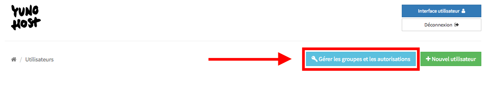
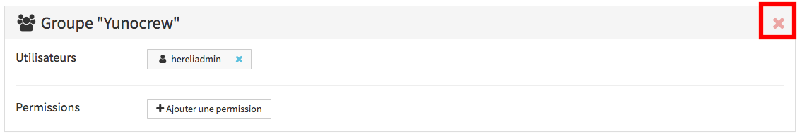
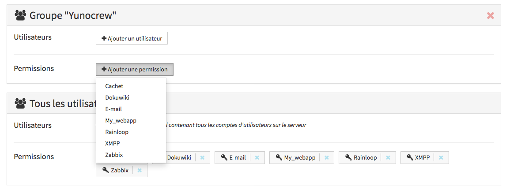
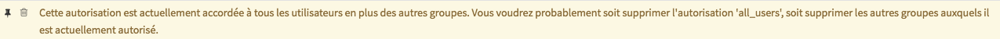

# Groupes et permissions

Vous pouvez accéder à l'interface de gestion des *groupes et des permissions* depuis la webadmin
en allant dans la section "Utilisateurs" et en cliquant sur le bouton correspondant :



## Gestion des groupes

Le mécanisme de groupe peut être utilisé pour définir des groupes d'utilisateurs qui peuvent ensuite être utilisés pour restreindre les autorisations pour les applications et autres services (tels que l'email ou XMPP). Notez qu'il n'est *pas* obligatoire de créer un groupe pour ce faire : vous pouvez également restreindre l'accès à une application ou à un service de manière individuelle.

L'utilisation de groupes est cependant utile pour la sémantique, par exemple si vous hébergez plusieurs groupes d'amis, des associations ou des entreprises sur votre serveur, vous pouvez créer des groupes comme "association1" et "association2" et ajouter les membres de chaque association au groupe concerné.


### Groupes par défaut
Par défaut, deux groupes spéciaux sont créés :
- `all_users`, qui contient tous les utilisateurs enregistrés sur YunoHost,
- `visitors`, c'est-à-dire les personnes qui consultent le serveur sans être connectées. 

Vous ne pouvez pas changer le contenu de ces groupes, seulement les permissions qui leur sont accordées.
 
### Lister les groupes existants
Les groupes existants sont listés en haut de la page *groupes et autorisations*.


Pour obtenir la liste des groupes existants en CLI :


```shell
$ yunohost user group list
groups:
  all_users:
    members:
      - alice
      - bob
      - charlie
      - delphine
```

### Créer un nouveau groupe
Pour créer un nouveau groupe, il suffit de cliquer sur le bouton "Nouveau groupe" en haut de la page. Vous ne pouvez choisir qu'un nom formé de lettres (majuscules et minuscules) et d'espaces. Le groupe est créé vide et sans aucune permissions.


Dans la CLI, pour créer un nouveau groupe appelé `yolo_crew`, il faut utiliser

```shell
$ yunohost user group create yolo_crew
```

### Mettre à jour un groupe
Ajoutons un premier utilisateur à ce groupe : dans le panneau du groupe, cliquez sur le bouton "ajouter un utilisateur" et faites défiler jusqu'à l'utilisateur souhaité, puis cliquez dessus.


Pour supprimer un utilisateur, cliquez sur la croix à côté de son nom d'utilisateur, dans le panneau du groupe.


En CLI, utilisez la commande suivante pour ajouter `charlie` et `delphine` au groupe `yolo_crew` :

```shell
$ yunohost user group update yolo_crew --add charlie delphine
```

(De même, `--remove` peut être utilisé pour retirer des membres d'un groupe)

Dans la liste des groupes, nous devrions voir :

```shell
$ yunohost user group list
groups:
  all_users:
    members:
      - alice
      - bob
      - charlie
      - delphine
  yolo_crew:
    members:
      - charlie
      - delphine
```

### Supprimer un groupe

Pour supprimer un groupe, cliquez sur la croix rouge en haut à droite du panneau du groupes. Une confirmation vous sera demandée.



Pour supprimer le groupe `yolo_crew` dans CLI, vous pouvez exécuter

```shell
$ yunohost user group delete yolo_crew
```

## Gestion des permissions

Le mécanisme de permissions permet de restreindre l'accès aux services (par exemple mail, XMPP...) et aux applications, ou même à des parties spécifiques des applications (par exemple l'interface d'administration de WordPress).

### Liste des permissions

La page des groupes liste les permissions données à chaque groupe, y compris les groupes spéciaux `all_users` et `visitors`.


Pour répertorier les permissions et les accès correspondants en CLI :
```shell
$ yunohost user permission list
permissions:
  mail.main:
    allowed: all_users
  wordpress.admin:
    allowed:
  wordpress.main:
    allowed: all_users
  xmpp.main:
    allowed: all_users
```
Ici, nous constatons que tous les utilisateurs enregistrés peuvent utiliser le courrier électronique, XMPP, et accéder au blog WordPress. Cependant, personne ne peut accéder à l'interface d'administration de WordPress.

Plus de détails peuvent être affichés en ajoutant l'option `--full` qui affichera la liste des utilisateurs correspondant aux groupes autorisés, ainsi que les urls associées à une permission (pertinent pour les applications web).

### Ajouter des permissions à un groupe ou un utilisateur

Pour ajouter une permission à un groupe, il suffit de cliquer sur le bouton "+" dans le panneau du groupe, de faire défiler jusqu'à la permission souhaitée, puis de cliquer dessus.



Pour permettre à un groupe d'accéder à l'interface d'administration de WordPress via la CLI :

```shell
$ yunohost user permission update wordpress.admin --add yolo_crew
```

Notez que vous pouvez également autoriser un seul utilisateur, en utilisant le panneau spécifique en bas de la page.


ou en CLI :

```shell
$ yunohost user permission update wordpress.admin --add alice
```

Et maintenant, nous pouvons voir que YoloCrew et Alice ont tous deux accès à l'interface d'administration de WordPress :

```shell
$ yunohost user permission list
  [...]
  wordpress.admin:
    allowed:
      - yolo_crew
      - alice
  [...]
```

Notez que, par exemple, si nous voulons restreindre la permission pour le courrier électronique 
afin que seul Bob soit autorisé à envoyer des courriels, nous devons également supprimer `all_users` 
de la permission, en la supprimant du panneau de groupe `all_users`, ou en CLI :

```shell
$ yunohost user permission update mail --remove all_users --add bob
```

La webadmin émettra un avertissement si vous définissez une permission qui est remplacée par une permission plus large.




## Notes aux packageurs d'applications

L'installation d'une application crée l'autorisation `app.main` avec `all_users` autorisée par défaut.

Si vous souhaitez rendre l'application accessible au public, au lieu de l'ancien mécanisme `unprotected_urls`, vous devez donner accès au groupe spécial `visitors` :

```shell
ynh_permission_update --permission "main" --add visitors
```

Si vous souhaitez créer une autorisation personnalisée pour votre application (par exemple pour restreindre l'accès à une interface d'administration), vous pouvez utiliser les helpers suivants :

```shell
ynh_permission_create --permission "admin" --url "/admin" --allowed "$admin_user"
```

Vous n'avez pas besoin de supprimer les autorisations ou de les sauvegarder / restaurer car elles sont gérées par le core de YunoHost.

### Migration hors de la gestion des autorisations héritées

Lors de la migration / correction d'une application utilisant toujours le système d'autorisations hérité, il faut comprendre que les accès doivent maintenant être gérés par des fonctionnalités du core, en dehors des scripts d'application !

Les scripts d'application devraient seulement :
- le cas échéant, pendant le script d'installation, initialiser l'autorisation principale de l'application en tant que public (`visitors`) ou privé (`all_users`) ou uniquement accessible à des groupes / utilisateurs spécifiques ;
- le cas échéant, créer et initialiser toute autre autorisation spécifique (par exemple, sur une interface d'administration) dans le script d'installation (et *sans doute* dans certaines migrations se produisant dans le script de mise à niveau).

Les scripts d'applications ne devraient absolument **PAS** altérer les accès aux applications déjà existantes (y compris les paramètres `unprotected` / `skipped_uris`), car cela réinitialiserait toutes les règles d'accès définies par l'administrateur !

Lors de la migration hors de l'autorisation héritée, vous devez :
- supprimer toute gestion du paramètre de type `$is_public` ou `$admin_user`, sauf pour toute question manifeste destinée à *initialiser* l'application avec des autorisations publiques / privées ou spécifiques ;
- supprimer toute gestion des paramètres `skipped_`, `unprotected_` et `protected_uris` (et `_regex`) qui sont désormais considérés comme obsolètes et dépréciés. (NB : vous devez **les supprimer explicitement dans le script upgrade**). Au lieu de cela, vous devriez désormais vous fier aux nouveaux helpers `ynh_permission_ *`. Si vous sentez que vous avez encore besoin de les utiliser, veuillez contacter l'équipe core pour pouvoir être assisté ;
Par exemple, dans le script *upgrade*, si vous avez utilisé la clé `protected_uris` auparavant, vous pouvez utiliser ce code dans la section `DOWNWARD COMPATIBILITY` :

```bash
protected_uris=$(ynh_app_setting_get --app=$app --key=protected_uris)

# Unused with the permission system
if [ ! -z "$protected_uris" ]; then
  ynh_app_setting_delete --app=$app --key=protected_uris
fi
```

- Supprimez tout appel à `yunohost app addaccess` et aux actions similaires qui sont désormais obsolètes et dépréciés.
- Si votre application utilise LDAP et prend en charge le filtre, utilisez le filtre `(&(objectClass=posixAccount)(permission=cn=YOUR_APP.main,ou=permission,dc=yunohost,dc=org))'` pour autoriser les utilisateurs ayant cette permission. (On trouvera une documentation sur LDAP [ici](https://moulinette.readthedocs.io/en/latest/ldap.html))

Voici un exemple de migration de code vers le nouveau système d'autorisation : [exemple](https://github.com/YunoHost/example_ynh/pull/111/files)

#### Cas spécifique : protection regex

Si vous devez toujours utiliser regex pour protéger ou déprotéger les URL, vous ne pouvez pas utiliser le nouveau système d'autorisation (pour l'instant).

Mais vous pouvez créer une fausse autorisation et utiliser des crochets pour gérer s'il y a un changement dans cette fausse autorisation.

Dans le script d'installation, créez la fausse autorisation (sans URL) :

`ynh_permission_create --permission="create poll" --allowed "visitors" "all_users"`

Utilisez ensuite la protection héritée :

```bash
# Make app public if necessary
if [ $is_public -eq 1 ]
then
  if [ "$path_url" == "/" ]; then
      # If the path is /, clear it to prevent any error with the regex.
      path_url=""
  fi
  # Modify the domain to be used in a regex
  domain_regex=$(echo "$domain" | sed 's@-@.@g')
  ynh_app_setting_set --app=$app --key=unprotected_regex --value="$domain_regex$path_url/create_poll.php?.*$","$domain_regex$path_url/adminstuds.php?.*"
else
  ynh_permission_update --permission="create poll" --remove="visitors"
fi
```

Dans cet exemple, si l'application est publique, le groupe `visitors` a accès à l'autorisation `create poll`, sinon le groupe est supprimé de cette autorisation.

Créez ensuite deux fichiers dans le répertoire `hooks` à la racine du dépôt Git de l'application : `post_app_addaccess` et `post_app_removeaccess`. Dans ces hooks, vous supprimerez ou rajouterez la protection contre les regex si le groupe `visitors` est ajouté ou supprimé de cette autorisation :

`post_app_addaccess`

```bash
#!/bin/bash

# Source app helpers
source /usr/share/yunohost/helpers

app=$1
added_users=$2
permission=$3
added_groups=$4

if [ "$app" == __APP__ ]; then
    if [ "$permission" = "create poll" ]; then # The fake permission "create poll" is modifed.
        if [ "$added_groups" = "visitors" ]; then # As is it a fake permission we can only grant/remove the "visitors" group.
            domain=$(ynh_app_setting_get --app=$app --key=domain)
            path_url=$(ynh_app_setting_get --app=$app --key=path)

            if [ "$path_url" == "/" ]; then
                # If the path is /, clear it to prevent any error with the regex.
                path_url=""
            fi
            # Modify the domain to be used in a regex
            domain_regex=$(echo "$domain" | sed 's@-@.@g')
            ynh_app_setting_set --app=$app --key=unprotected_regex --value="$domain_regex$path_url/create_poll.php?.*$","$domain_regex$path_url/adminstuds.php?.*"

            # Sync the is_public variable according to the permission
            ynh_app_setting_set --app=$app --key=is_public --value=1

            yunohost app ssowatconf
        else
            ynh_print_warn --message="This app doesn't support this authorisation, you can only add or remove visitors group."
        fi
    fi
fi
```

`post_app_removeaccess`

```bash
#!/bin/bash

# Source app helpers
source /usr/share/yunohost/helpers

app=$1
removed_users=$2
permission=$3
removed_groups=$4

if [ "$app" == __APP__ ]; then
    if [ "$permission" = "create poll" ]; then # The fake permission "create poll" is modifed.
        if [ "$removed_groups" = "visitors" ]; then # As is it a fake permission we can only grant/remove the "visitors" group.
            
            # We remove the regex, no more protection is needed.
            ynh_app_setting_delete --app=$app --key=unprotected_regex

            # Sync the is_public variable according to the permission
            ynh_app_setting_set --app=$app --key=is_public --value=0

            yunohost app ssowatconf
        else
            ynh_print_warn --message="This app doesn't support this authorisation, you can only add or remove visitors group."
        fi
    fi
fi
```

N'oubliez pas de remplacer `__APP__` pendant le script *install* / *upgrade*.

Voici quelques applications qui utilisent ce cas spécifique : [Lutim](https://github.com/YunoHost-Apps/lutim_ynh/pull/44/files) et [OpenSondage](https://github.com/YunoHost-Apps/opensondage_ynh/pull/59/files)

Si vous avez des questions, veuillez contacter un des membres du groupe apps.
