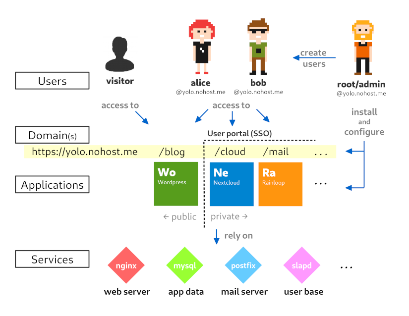

Overview of the YunoHost ecosystem
==================================
 
This page provide an overview of the ecosystem of a YunoHost server. While this overview contains several approximations, the purpose here is to introduce the global picture before digging into the different aspects.

Everything starts with the special user **admin**. This is the administrator of the machine who can install, configure and manage things on the server through the web administration interface, or via SSH and the command line interface. *(If you are already familiar with Linux, it is quite similar to root. YunoHost has this additional 'admin' user for several technical reasons.)*

The administrator can create users and install applications, among other admin actions. Users automatically have their own email adress as well as an XMPP account when they get created. Users will also be able to connect to the user portal (SSO) to access applications. Some applications can typically be installed either as publicly-accessible, or as private, i.e. only some users will have access to it.

Applications and ther features of the server rely on different services to work properly. Services (sometimes also called daemons) are programs that are constantly running on the server to ensure various tasks are done, such as answering to web requests from web browsers, or relaying emails.

