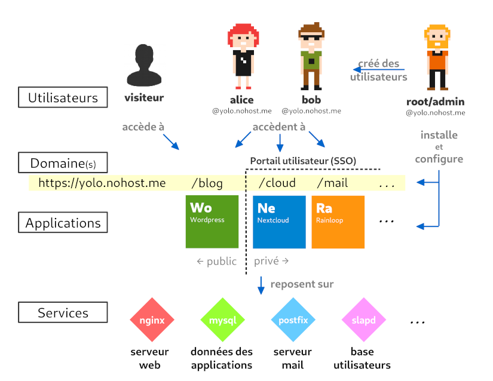

Vue d'ensemble de l'écosystème YunoHost
=======================================
 
Cette page pose une vue d'ensemble de l'écosystème d'un serveur sous YunoHost. Bien que celle-ci contienne des approximations et des raccourcis, elle permet de poser une première représentation générale avant de rentrer plus dans le détail des différents aspects.

Tout commence avec l'utilisateur spécial, **admin**. Il s'agit de l'administrateur de la machine qui peut installer, configurer et gérer le serveur à travers l'interface web d'administration, ou via SSH et la ligne de commande. *(Si vous êtes familier avec Linux, il est similaire à root. YunoHost possède cet utilisateur supplémentaire 'admin' pour plusieurs raisons techniques.)*

L'administrateur peut créer des utilisateurs et installer des applications, parmis d'autres actions d'administration. Les utilisateurs disposent immédiatement d'une adresse email sur le serveur et d'un compte XMPP. Les utilisateurs peuvent se connecter au portail utilisateur (SSO) pour accéder aux applications. Les applications peuvent typiquement être installées soient en accès public, ou privé, c'est-à-dire que seul les utilisateurs du serveur pourront y accéder.

Les applications et autres fonctionnalités du serveur reposent sur plusieurs services pour fonctionner proprement. Les services (aussi appelés daemon) sont des programmes qui tournent constamment pour assurer des tâches, telles que répondre aux requêtes web des navigateurs web, ou relayer les emails.
