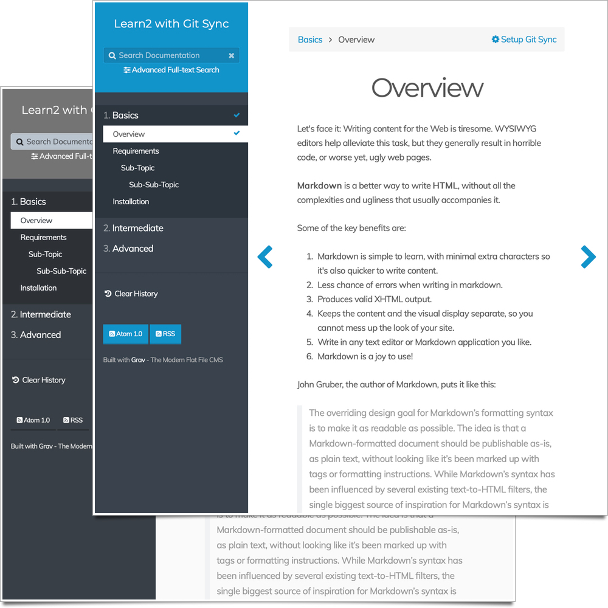

# Learn2 with Git Sync

Learn2 with Git Sync is a customized version of the default [Grav Learn](http://learn.getgrav.org) theme. Includes selectable visual styles.

Want to quickly try out this theme? The [Learn2 with Git Sync Skeleton](https://getgrav.org/downloads/skeletons) is a ready-to-run site with the Learn2 with Git Sync Theme, which also includes the Admin Panel and example content already installed.

# Installation

Installing the Learn2 with Git Sync theme can be done in one of two ways. Our GPM (Grav Package Manager) installation method enables you to quickly and easily install the theme with a simple terminal command, while the manual method enables you to do so via a zip file.

The theme is designed to be used to provide a documentation site. You can see this in action at [learn.hibbittsdesign.org](http://learn.hibbittsdesign.org)

## GPM Installation (Preferred)

The simplest way to install this theme is via the [Grav Package Manager (GPM)](http://learn.getgrav.org/advanced/grav-gpm) through your system's Terminal (also called the command line).  From the root of your Grav install type:

    bin/gpm install learn2-git-sync

This will install the Learn2 with Git Sync theme into your `/user/themes` directory within Grav. Its files can be found under `/your/site/grav/user/themes/learn2-git-sync`.

## Manual Installation

To install this theme, just download the zip version of this repository and unzip it under `/your/site/grav/user/themes`. Then, rename the folder to `learn2-git-sync`.

You should now have all the theme files under

    /your/site/grav/user/themes/learn2-git-sync

>> NOTE: This theme is a modular component for Grav which requires the [Grav](http://github.com/getgrav/grav), [Error](https://github.com/getgrav/grav-theme-error) and [Problems](https://github.com/getgrav/grav-plugin-problems) plugins.

# Updating

As development for the Learn2 with Git Sync theme continues, new versions may become available that add additional features and functionality, improve compatibility with newer Grav releases, and generally provide a better user experience. Updating Learn2 with Git Sync is easy, and can be done through Grav's GPM system, as well as manually.

## GPM Update (Preferred)

The simplest way to update this theme is via the [Grav Package Manager (GPM)](http://learn.getgrav.org/advanced/grav-gpm). You can do this with this by navigating to the root directory of your Grav install using your system's Terminal (also called command line) and typing the following:

    bin/gpm update learn2-git-sync

This command will check your Grav install to see if your Learn2 with Git Sync theme is due for an update. If a newer release is found, you will be asked whether or not you wish to update. To continue, type `y` and hit enter. The theme will automatically update and clear Grav's cache.

## Manual Update

Manually updating Learn2 with Git Sync is pretty simple. Here is what you will need to do to get this done:

* Delete the `your/site/user/themes/learn2-git-sync` directory.
* Download the new version of the Learn2 with Git Sync theme from either [GitHub](https://github.com/hibbitts-design/grav-theme-learn2-git-sync) or [GetGrav.org](http://getgrav.org/downloads/themes#extras).
* Unzip the zip file in `your/site/user/themes` and rename the resulting folder to `learn2-git-sync`.
* Clear the Grav cache. The simplest way to do this is by going to the root Grav directory in terminal and typing `bin/grav clear-cache`.

> Note: Any changes you have made to any of the files listed under this directory will also be removed and replaced by the new set. Any files located elsewhere (for example a YAML settings file placed in `user/config/themes`) will remain intact.

### Recompile CSS from SCSS

To recompile default style using a Sass-compiler, run it on /scss/theme.scss and output to /css-compiled/theme.css, like `node-sass --watch --source-map true scss/theme.scss css-compiled/theme.css`. To do the same for custom styles, run it on /scss/custom and output to /css-compiled/custom, like `node-sass --watch --source-map true scss/custom/ css-compiled/custom`.

## Features

* Lightweight and minimal for optimal performance
* Fully responsive with off-page mobile navigation
* SCSS based CSS source files for easy customization
* Built specifically for providing easy to read documentation
* Fontawesome icon support

### Supported Page Templates

* "Docs" template
* "Chapter" template
* Error view template

## Setup

🚨Before setting up Git Sync, please make sure to remove the `ReadMe.md` file in your Grav site `user` folder (if one exists). This will prevent a possible sync issue when creating a default `ReadMe.md` file in your new Git repository.🚨

If you want to set Learn2 with Git Sync as the default theme, you can do so by following these steps:

* Navigate to `/your/site/grav/user/config`.
* Open the **system.yaml** file.
* Change the `theme:` setting to `theme: learn2-git-sync`.
* Save your changes.
* Clear the Grav cache. The simplest way to do this is by going to the root Grav directory in Terminal and typing `bin/grav clear-cache`.

Once this is done, you should be able to see the new theme on the frontend. Keep in mind any customizations made to the previous theme will not be reflected as all of the theme and templating information is now being pulled from the **learn2-git-sync** folder.

### TNTSearch Configuration

The default search route for the TNTSearch plugin (used for the 'Advanced Search' feature) is set to `/tntsearch`
