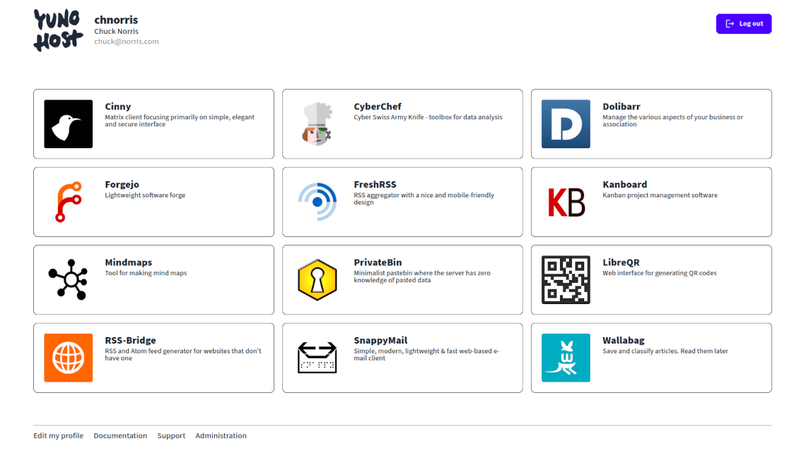

Users and the SSO
=================

Users
-----

Users are human being who have access to applications and other services on your server. The administrator can add and manage users through the web administration (in the User category) or through the command line (see `yunohost user --help`). After that, users obtain a personal email address (chosen by the admin), an XMPP account, and can log in the user portal to access applications they have permissions over and configure other parameters.

The first user created also automatically gets email aliases `root@main.domain.tld` and `admin@main.domain.tld`, such that mail sent to these adresses will end up in the first user's mailbox.

You should be careful about who you give your server access to. In terms of security, this largely increase the attack surface for someone who wants to mess with the server one way or another.

The user portal, or SSO
-----------------------

The user portal, also called the SSO for 'Single Sign On' allows user to browse easily between the different apps they have access to. In particular, the term 'Single Sign On' comes from the fact that user only need to log in the portal to automatically be logged to all apps that require authentication (or at least those who are integrated with the SSO/LDAP, since this is sometimes technically complicated or not possible at all).

In the portal, users can also click on the avatar in the top-left to configure some other settings such as their identify, mail aliases, automatic mail forwards, or change their password.

You should be aware that the SSO can only be reached through the actual domain name (i.e. `https://the.domain.tld/yunohost/sso`), and NOT by just using the IP of the server (i.e. `https://11.22.33.44/yunohost/sso`), contrarily to the webadmin ! This is a bit confusing but is necessary for technical reason. If you are in a situation where you need to access the SSO without having your DNS properly configured for some reason, you might consider tweaking your `/etc/hosts` as described in [this page](dns_local_network).

User groups and permissions
---------------------------

See [this dedicated page](groups_and_permissions).

SSH access
----------

Users can also be allowed to connect through SSH, and SSH keys can be added for this purpose. So far, this can only be configured via the command line. See `yunohost user ssh --help` for specific commands.

Be careful who you give SSH access to. This increases even more the attack surface available to a malicious user.

