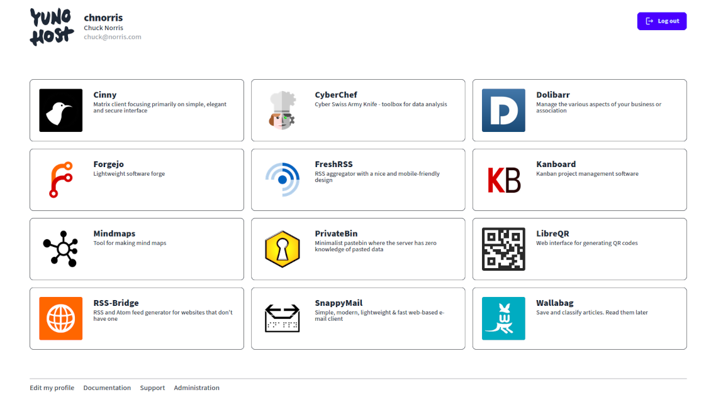

Les utilisateurs et le SSO
==========================

Utilisateurs
-----

Les utilisateurs sont les êtres humains qui ont accès aux applications et autres services sur votre serveur. L'administrateur peut ajouter et gérer des utilisateurs via l'administration web (dans la catégorie Utilisateurs) ou via la catégorie `yunohost user` de la ligne de commande. Après cela, les utilisateurs obtiennent une adresse e-mail personnelle (choisie par l'administrateur), un compte XMPP, et peuvent se connecter au portail utilisateur (SSO) pour accéder aux applications pour lesquelles ils ont des permissions et configurer d'autres paramètres.

Le premier utilisateur créé reçoit aussi automatiquement les alias email `root@main.domain.tld` et `admin@main.domain.tld`, de sorte que le courrier envoyé à ces adresses se retrouvera dans la boîte aux lettres de cet utilisateur.

Vous devriez faire attention à qui vous donnez l'accès à votre serveur. En termes de sécurité, cela augmente considérablement la surface d'attaque pour quelqu'un qui veut perturber le serveur d'une manière ou d'une autre.

Le portail utilisateur, ou SSO
-----------------------

Le portail utilisateur, également appelé SSO pour 'Single Sign On', permet à l'utilisateur de naviguer facilement entre les différentes applications auxquelles il a accès. En particulier, le terme 'Single Sign On' vient du fait que l'utilisateur n'a qu'à se connecter au portail pour être automatiquement connecté à toutes les applications qui nécessitent une authentification (ou du moins celles qui sont intégrées avec le SSO/LDAP, car cela est parfois techniquement compliqué ou pas possible du tout).

Dans le portail, les utilisateurs peuvent également cliquer sur l'avatar en haut à gauche pour configurer d'autres paramètres tels que leur identité, les alias de messagerie, les transferts automatiques de courrier ou changer leur mot de passe.

Vous devez être conscient que le SSO ne peut être atteint que par le nom de domaine (c.-à-d. `https://the.domain.tld/yunohost/sso`), et non pas en utilisant l'IP du serveur (c.-à-d. `https://11.22.33.44/yunohost/sso`), contrairement à l'administrateur web ! C'est un peu déroutant dans certaines situations, mais c'est nécessaire pour des raisons techniques. Si vous êtes dans une situation où vous avez besoin d'accéder au SSO sans avoir votre DNS correctement configuré pour une raison quelconque, vous pouvez envisager de modifier votre `/etc/hosts` comme décrit dans [cette page](dns_local_network).

Gestion des groupes d'utilisateurs et permissions
---------------------------

Voir [cette page de documentation dédiée](groups_and_permissions).

Accès SSH
----------

Les utilisateurs peuvent également être autorisés à se connecter via SSH, et des clés SSH peuvent être ajoutées à cette fin. Jusqu'à présent, ceci ne peut être configuré que via la ligne de commande. Voir `yunohost user ssh --help` pour des commandes spécifiques.

Faites attention à qui vous donnez accès à SSH. Cela augmente encore plus la surface d'attaque disponible pour un utilisateur malveillant.

